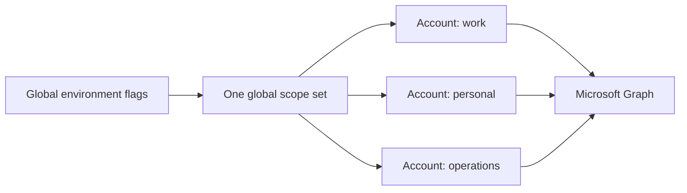
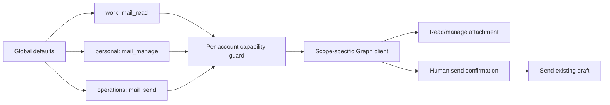

# Per-account mail profiles, attachments, and send

## Change Summary

The fork will authenticate through an owned Microsoft Entra public-client
application, support work, school, and personal Microsoft accounts, and select
mail permissions independently for each connected account. It will add local
file attachments to drafts and an opt-in `mail.send_draft` operation while
preserving draft-only behavior as the default risk profile.

The implementation baseline is `jantoney/outlook-local-mcp` `main` at commit
`5b22fb5`. At the time of this request, fork `main`, upstream `main`, and the
local checkout all resolve to that commit.

## Motivation and Background

The installed v0.4.0 binary can create and update drafts but cannot attach a
new local file. Current upstream `main` can list and download existing
attachments, but it still has no upload verb. This prevents end-to-end draft
automation for workflows that prepare invoices, reports, or other documents.

The running configuration also relies on a Microsoft-owned first-party client
ID because `OUTLOOK_MCP_CLIENT_ID` is unset. The user cannot control that app's
supported account audience or permission configuration and has been unable to
authenticate personal Microsoft 365 accounts reliably.

The existing server deliberately never requests `Mail.Send`. That is a sound
default, but it applies one risk decision to every connected account. The user
wants to accept different risk levels for different accounts, such as keeping
a personal account draft-only while allowing a dedicated operational account
to send a reviewed draft.

## Change Drivers

* User feedback requires local-file attachment upload.
* Personal Microsoft accounts must authenticate through an app registration
  controlled by the fork owner.
* Permission risk must be chosen per account rather than once per server.
* Existing draft-only behavior must remain the default and migration-safe.
* Sending must retain a real human confirmation boundary.

## Current State

The server uses Microsoft Graph already. It requests delegated calendar and
mail scopes from a single global `config.Config`:

* `Calendars.ReadWrite` is always requested.
* `Mail.Read` is requested when `MailEnabled` is true.
* `Mail.ReadWrite` replaces `Mail.Read` when `MailManageEnabled` is true.
* `Mail.Send` is never requested.

`AccountConfig` persists `label`, `client_id`, `tenant_id`, `auth_method`, and
`upn`. It does not persist account-specific capabilities. `AccountEntry` holds
the credential and Graph client but does not record the scopes or risk profile
used to create them.

Mail verbs are registered at server startup from global feature flags. This is
incompatible with accounts added at runtime having different capabilities:
the operation enum cannot be rebuilt safely each time an account is added.

The server has `mail.list_attachments` and `mail.get_attachment` read verbs.
It has no operation that reads a local file and uploads it to a Graph draft.

### Current State Diagram



## Proposed Change

Each account will have one cumulative `mail_profile`:

| Profile | Requested mail scopes | Allowed mail behavior |
|---|---|---|
| `calendar_only` | none | Calendar operations only |
| `mail_read` | `Mail.Read` | Read mail and existing attachments |
| `mail_manage` | `Mail.ReadWrite` | Read mail, manage drafts, add attachments; no send |
| `mail_send` | `Mail.ReadWrite`, `Mail.Send` | All managed-draft operations plus confirmed draft send |

Every profile also requests `User.Read` and `Calendars.ReadWrite`. `User.Read`
is required because the implementation calls Graph `GET /me` to resolve the
authenticated account UPN. The current omission will be corrected.

The global mail flags remain supported as backward-compatible defaults. An
account-specific `mail_profile` always overrides the derived default.

### Default Profile Derivation

The implicit/default account and legacy account records without a profile use
this precedence:

1. `OUTLOOK_MCP_MAIL_SEND_ENABLED=true` produces `mail_send`.
2. Otherwise `OUTLOOK_MCP_MAIL_MANAGE_ENABLED=true` produces `mail_manage`.
3. Otherwise `OUTLOOK_MCP_MAIL_ENABLED=true` produces `mail_read`.
4. Otherwise the profile is `calendar_only`.

`OUTLOOK_MCP_MAIL_SEND_ENABLED` defaults to `false` and implies both mail
management and mail read for compatibility with the cumulative model.

### Account Lifecycle

`account.add` gains an optional `mail_profile` parameter. The profile is
persisted in `accounts.json`, stored in the runtime registry entry, used to
derive authentication scopes, and included in account/status output.

`account.set_mail_profile` changes an existing account's profile. Any change
invalidates that account's local Graph client and cached authentication state,
marks the account disconnected, and requires fresh authentication before the
new profile becomes active.

Lowering a profile immediately blocks disallowed operations before any network
call. Clearing local tokens and reauthenticating prevents reuse of cached
access tokens, but it cannot revoke consent already stored by Microsoft. The
tool response and troubleshooting documentation must explain how to revoke app
consent in the Microsoft account or Entra tenant when full revocation is wanted.

### Static Tool Surface and Runtime Authorization

The aggregate `mail` tool will register all supported verbs at startup. Each
verb will declare its minimum profile in the registry. A capability middleware,
executed after account resolution and before the handler, will compare the
selected account profile with the verb requirement.

This preserves a stable MCP JSON schema while enforcing least privilege for
the actual account chosen on each call. `operation=help` will display the
minimum profile for every verb.

### Local Attachment Upload

`mail.add_attachment` accepts one `message_id` and one `file_path`. The handler
verifies that the message exists and has `isDraft=true` before reading file
content.

Local file access is independently gated by `OUTLOOK_MCP_ATTACHMENT_ROOTS`.
The setting is a platform-path-list of allowlisted directories. An empty value
disables local attachment upload. The handler resolves the requested path and
its parent to canonical absolute paths and rejects paths outside every root,
including traversal and symlink/junction escapes.

Upload selection uses raw file size:

* Smaller than 3 MiB: direct Graph attachment POST.
* From 3 MiB through 150 MiB: resumable Outlook attachment upload session.
* Larger than 150 MiB: rejected before upload.

The large-file uploader will use sequential 3 MiB chunks, follow
`nextExpectedRanges`, honor caller cancellation and configured deadlines, and
never log the opaque pre-authenticated upload URL.

### Confirmed Draft Send

`mail.send_draft` is the only operation introduced that uses `Mail.Send`. It
accepts an existing draft ID and does not accept recipients, subject, body, or
attachments. Users and agents must construct the draft through the existing
draft operations first.

Before sending, the handler fetches and displays the draft subject, recipients,
and attachment names through MCP elicitation. The send proceeds only after the
human explicitly accepts that elicitation. If the MCP client does not support
elicitation, the operation fails safely and instructs the user to send through
Outlook. There is no boolean confirmation fallback that an agent can set by
itself.

Graph returns `202 Accepted` for draft send. The confirmation must state that
Graph accepted the request and that final delivery remains subject to Exchange
processing; it must not claim confirmed delivery.

### Proposed State Diagram



## Requirements

### Functional Requirements

1. The system **MUST** define the four ordered mail profiles
   `calendar_only`, `mail_read`, `mail_manage`, and `mail_send`.
2. Each account **MUST** persist exactly one `mail_profile` in `accounts.json`.
3. Legacy accounts without `mail_profile` **MUST** derive their profile from
   global flags without changing existing behavior.
4. `account.add` **MUST** accept an optional `mail_profile` parameter.
5. `account.set_mail_profile` **MUST** change one existing account profile and
   require reauthentication before the changed profile is active.
6. The runtime registry **MUST** record the active profile and scope set for
   every account.
7. Status and account-list output **MUST** show each account's mail profile.
8. OAuth scope construction **MUST** be performed per account.
9. Every account **MUST** request delegated `User.Read` and
   `Calendars.ReadWrite`.
10. `calendar_only` **MUST NOT** request a delegated mail scope.
11. `mail_read` **MUST** request `Mail.Read` and **MUST NOT** request
    `Mail.ReadWrite` or `Mail.Send`.
12. `mail_manage` **MUST** request `Mail.ReadWrite` and **MUST NOT** request
    `Mail.Send`.
13. `mail_send` **MUST** request `Mail.ReadWrite` and `Mail.Send`.
14. `OUTLOOK_MCP_MAIL_SEND_ENABLED` **MUST** default to false.
15. Enabling the global send flag **MUST** imply mail management and mail read.
16. The mail domain **MUST** register a stable operation schema independent of
    the accounts connected at startup.
17. Every mail verb **MUST** declare a minimum account profile.
18. The capability guard **MUST** reject insufficient profiles before the verb
    makes a Graph API call.
19. `mail.add_attachment` **MUST** require profile `mail_manage` or higher.
20. `mail.add_attachment` **MUST** operate only on an existing draft message.
21. `mail.add_attachment` **MUST** accept exactly one local file per invocation.
22. Local upload **MUST** be disabled when `OUTLOOK_MCP_ATTACHMENT_ROOTS` is
    empty.
23. Local upload **MUST** reject any canonical file path outside all configured
    attachment roots.
24. Files below 3 MiB **MUST** use direct attachment POST.
25. Files from 3 MiB through 150 MiB **MUST** use a resumable upload session.
26. Files above 150 MiB **MUST** be rejected before file content is uploaded.
27. Resumable ranges **MUST** be sequential and follow Graph
    `nextExpectedRanges` responses.
28. The upload URL **MUST NOT** be logged, audited, returned, or persisted.
29. Attachment success **MUST** include verified attachment ID, name, byte
    size, content type, draft ID, account, and upload mode.
30. `mail.send_draft` **MUST** require profile `mail_send`.
31. `mail.send_draft` **MUST** accept only an existing draft ID.
32. `mail.send_draft` **MUST** present subject, recipients, and attachment names
    to the human through MCP elicitation before the Graph send call.
33. Declined, failed, timed-out, or unsupported elicitation **MUST** prevent the
    send call.
34. `mail.send_draft` **MUST NOT** accept a model-supplied boolean as a
    substitute for human confirmation.
35. A successful Graph `202 Accepted` response **MUST** be described as
    accepted for processing, not delivered.
36. Read-only mode **MUST** block attachment upload, profile mutation, and send.
37. All account-specific authorization failures **MUST** identify the selected
    account, current profile, and required profile without exposing tokens.

### Non-Functional Requirements

1. Existing accounts and configurations **MUST** continue to load without
   manual migration.
2. Profile comparison **MUST** use a single typed implementation rather than
   string ordering distributed across handlers.
3. Per-account credential and Graph-client construction **MUST** use only the
   scopes produced for that account profile.
4. Profile reduction **MUST** invalidate local cached authentication material
   before the account can make another Graph call.
5. Attachment path validation **MUST** resist traversal and filesystem-link
   escapes on Windows, macOS, and Linux.
6. Attachment uploads **MUST** observe MCP cancellation, configured per-request
   timeouts, and an overall operation deadline.
7. Direct non-idempotent upload failures **MUST NOT** be blindly retried when
   the outcome is uncertain.
8. Resumable range uploads **MUST** resume from server-reported ranges after a
   retryable failure.
9. The implementation **MUST NOT** add a client secret to configuration,
   persistence, logs, or distribution artifacts.
10. Audit events **MUST** include account, profile, operation, resource ID, and
    outcome while excluding message bodies, attachment bytes, and upload URLs.

## Affected Components

* `internal/config` — global default derivation, send flag, attachment roots.
* `internal/auth` — typed profiles, profile scopes, persisted account metadata,
  registry entries, restore and cache invalidation.
* `internal/tools` — attachment handler, send handler, profile guard, account
  profile mutation, confirmations, and text output.
* `internal/server` — verb registration, minimum-profile metadata, annotations.
* `internal/validate` — canonical attachment path validation.
* `extension/manifest.json` — new environment inputs and updated mail tool text.
* `docs/concepts.md` — profiles, permissions, confirmation, consent limits.
* `docs/quickstart.md` — owned Entra app and attachment-root setup.
* `docs/troubleshooting.md` — re-consent, revocation, and send failures.
* `docs/prompts/mcp-tool-crud-test.md` — account-profile and attachment tests.

## Scope Boundaries

### In Scope

* Owned public-client Entra configuration for organisational and personal users.
* Fixing the missing `User.Read` requested scope.
* Per-account cumulative mail profiles.
* Runtime enforcement of profile requirements.
* Direct and resumable local-file attachment upload to drafts.
* Human-confirmed sending of an existing draft.
* Profile changes with token/cache invalidation and reauthentication.
* Documentation and packaging changes needed for these capabilities.

### Out of Scope ("Here, But Not Further")

* Direct `sendMail` creation-and-send in one call.
* Direct reply, reply-all, or forward-and-send operations.
* Scheduled delivery or delivery-status tracking.
* Application permissions, daemon auth, or unattended shared-mailbox sending.
* Revoking Microsoft-side consent automatically.
* Uploading item attachments or reference attachments.
* Inline image/CID composition in this change.
* Multiple local files in one tool call.
* Attachments on events or calendar items.
* Outlook COM, EWS, SMTP, or IMAP backends.

## Alternative Approaches Considered

### Global `Mail.Send` flag only

Rejected because one global setting gives every connected account the same
risk profile and does not satisfy the user's account-specific requirement.

### Independent booleans per account

Rejected because combinations such as send enabled without draft management
are confusing. Ordered cumulative profiles make invalid combinations
unrepresentable and simplify enforcement and documentation.

### Dynamically rebuild the MCP operation enum

Rejected because accounts can be added or changed while the server is running.
Changing a registered tool schema mid-session would produce unstable client
behavior. A static schema plus runtime guard is predictable.

### Allow direct send operations

Rejected for the first implementation. Sending only an existing draft keeps
the reviewable-draft workflow and minimizes the new high-risk surface.

### Model-supplied `confirm=true`

Rejected because the same agent that proposes the send can also set the flag.
MCP elicitation provides a distinct human decision boundary.

### Unrestricted local paths

Rejected because a mail-capable MCP could otherwise exfiltrate any readable
local file. Explicit canonical roots make filesystem authority visible and
configurable.

## Impact Assessment

### User Impact

Users can select a risk profile when adding each account. Existing accounts
continue to behave according to the current global flags. Accounts promoted to
`mail_send` require a new consent interaction; accounts demoted require
reauthentication and may require manual Microsoft-side consent revocation if
the user wants the previously granted permission removed entirely.

Attachment users must configure at least one allowed root. Send users must use
an MCP client that supports elicitation; otherwise sending remains safely
unavailable and drafts can still be sent from Outlook.

### Technical Impact

Scope selection moves from global configuration to account metadata. Mail verb
registration becomes static and authorization moves into middleware after
account selection. The account JSON schema gains an optional field with a
backward-compatible default derivation.

Large attachments add a bounded streaming uploader. Send adds a non-idempotent
Graph action returning asynchronous acceptance, so retry and result language
must be conservative.

### Business Impact

The fork becomes suitable for both conservative personal use and higher-trust
operational accounts without requiring separate server processes. It also
closes the attachment gap that currently blocks complete draft automation.

## Implementation Approach

### Phase 1: Permission model and owned authentication

1. Add typed profile parsing, validation, ordering, and scope derivation.
2. Add `User.Read` to every profile.
3. Persist profile in `AccountConfig` and `AccountEntry`.
4. Derive legacy defaults from existing global flags.
5. Make credential/client factories account-scope aware.
6. Add profile status output and account mutation operation.

### Phase 2: Stable mail registry and guard

1. Add minimum profile metadata to mail verbs.
2. Register the complete mail verb set once at startup.
3. Add account-profile middleware after account resolution.
4. Preserve `ReadOnlyGuard` for every mutating verb.
5. Render minimum profiles in `mail.help`.

### Phase 3: Attachment upload

1. Add attachment-root configuration and canonical validation.
2. Add draft verification and file metadata checks.
3. Implement direct small-file upload.
4. Implement cancellation-aware resumable upload.
5. Add verified confirmation formatting and audit events.

### Phase 4: Confirmed draft send

1. Add draft preview retrieval.
2. Add required human elicitation.
3. Call Graph draft send only after acceptance.
4. Return accurate asynchronous acceptance text.
5. Add safe failure behavior for unsupported clients.

### Phase 5: Documentation and release readiness

1. Update the registry-owned verb reference and narrative documentation.
2. Update the MCPB manifest and CRUD prompt.
3. Run repository quality checks.
4. Build a Windows binary from the fork branch for live validation.

## Test Strategy

### Tests to Add

| Test File | Test Name | Description | Inputs | Expected Output |
|---|---|---|---|---|
| `internal/auth/profile_test.go` | `TestParseMailProfile` | Validates profile parsing | Four valid names and invalid text | Typed profiles or error |
| `internal/auth/profile_test.go` | `TestMailProfileAllows` | Validates ordered capabilities | All profile pairs | Correct allow/deny matrix |
| `internal/auth/auth_test.go` | `TestScopesForProfile` | Validates exact per-profile scopes | Four profiles | Expected scope arrays |
| `internal/auth/auth_test.go` | `TestScopesAlwaysIncludeUserRead` | Covers `/me` permission | All profiles | `User.Read` present |
| `internal/auth/accounts_test.go` | `TestAccountProfileRoundTrip` | Persists profile | Account config | Same loaded profile |
| `internal/auth/accounts_test.go` | `TestLegacyAccountProfileDefault` | Migrates missing profile | Legacy JSON and globals | Derived profile |
| `internal/tools/profile_guard_test.go` | `TestMailProfileGuard` | Blocks insufficient accounts | Verb requirement/profile pairs | No handler call on deny |
| `internal/tools/set_mail_profile_test.go` | `TestSetMailProfileRequiresReauth` | Changes profile safely | Existing account/new profile | Disconnected and cache cleared |
| `internal/validate/attachment_path_test.go` | `TestAttachmentPathWithinRoot` | Accepts allowed files | Canonical child path | Success |
| `internal/validate/attachment_path_test.go` | `TestAttachmentPathTraversalRejected` | Blocks traversal | Parent escape | Error |
| `internal/validate/attachment_path_test.go` | `TestAttachmentPathLinkEscapeRejected` | Blocks link escape | Link outside root | Error |
| `internal/tools/add_attachment_test.go` | `TestAddAttachmentRejectsNonDraft` | Enforces draft-only | `isDraft=false` | Tool error, no file read |
| `internal/tools/add_attachment_test.go` | `TestAddAttachmentDirectBoundary` | Selects direct upload | File below 3 MiB | Direct POST |
| `internal/tools/add_attachment_test.go` | `TestAddAttachmentSessionBoundary` | Selects session upload | File at 3 MiB | Session creation |
| `internal/tools/add_attachment_test.go` | `TestAddAttachmentMaximumRejected` | Enforces ceiling | File above 150 MiB | Pre-upload error |
| `internal/tools/attachment_uploader_test.go` | `TestUploaderFollowsExpectedRanges` | Resumes ranges | Mock intermediate replies | Correct sequential PUTs |
| `internal/tools/attachment_uploader_test.go` | `TestUploaderDoesNotAuthorizeUploadURL` | Protects opaque URL | Mock request | No Authorization header |
| `internal/tools/attachment_uploader_test.go` | `TestUploaderHonorsCancellation` | Stops promptly | Cancelled context | No later chunks |
| `internal/tools/send_draft_test.go` | `TestSendDraftRequiresMailSendProfile` | Enforces profile | Manage account | No Graph send |
| `internal/tools/send_draft_test.go` | `TestSendDraftDeclined` | Honors human decline | Elicitation decline | No Graph send |
| `internal/tools/send_draft_test.go` | `TestSendDraftUnsupportedElicitation` | Fails safely | Unsupported client | No Graph send |
| `internal/tools/send_draft_test.go` | `TestSendDraftAccepted` | Sends reviewed draft | Accepted elicitation | One Graph send, accepted text |

### Tests to Modify

| Test File | Test Name | Current Behavior | New Behavior | Reason for Change |
|---|---|---|---|---|
| `internal/auth/auth_test.go` | Existing `TestScopes_*` tests | Global mail flags | Default-profile derivation and `User.Read` | Scope model changed |
| `internal/auth/auth_test.go` | `TestScopes_NoMailSend` | Send is impossible | Send only for `mail_send` | New opt-in behavior |
| `internal/config/config_test.go` | Mail flag tests | Read/manage flags only | Include send implication | New global default |
| `internal/tools/add_account_test.go` | Add-account cases | Global scopes | Optional per-account profile | New parameter |
| `internal/auth/restore_test.go` | Restore cases | No profile | Restore stored/legacy profiles | Persistence changed |
| `internal/server/tool_description_test.go` | Mail verbs | Flag-gated verbs | Stable verbs with requirements | Registry changed |
| `internal/tools/tool_annotations_test.go` | Mail matrix | No send verb | Include send semantics | Tool surface changed |
| `extension/manifest_test.go` | Tool/config assertions | No send or roots | New settings and description | Manifest synchronization |

### Tests to Remove

No tests are removed solely for this change. Assertions that require mail verbs
to disappear from the schema when global flags are false will be replaced by
profile-guard assertions because that behavior is intentionally superseded.

## Acceptance Criteria

### AC-1: Backward-compatible default

```gherkin
Given an existing accounts.json entry without mail_profile
  And OUTLOOK_MCP_MAIL_MANAGE_ENABLED is true
When the server restores the account
Then the account profile is mail_manage
  And Mail.Send is not requested
```

### AC-2: Personal and organisational app audience

```gherkin
Given the owned public-client app supports organisational and personal accounts
  And the MCP uses tenant common
When a work account and a personal account authenticate
Then each account obtains delegated tokens for its selected profile
  And no client secret is used
```

### AC-3: Account-specific send isolation

```gherkin
Given account personal has profile mail_manage
  And account operations has profile mail_send
When mail.send_draft is attempted for personal
Then the capability guard rejects the call before Graph access
When mail.send_draft is attempted for operations
Then the operation proceeds to human elicitation
```

### AC-4: Profile reduction

```gherkin
Given an account previously used profile mail_send
When account.set_mail_profile changes it to mail_read
Then send and draft mutation are blocked immediately
  And local cached authentication state is invalidated
  And the account must authenticate again with the reduced scope set
```

### AC-5: Allowed local attachment

```gherkin
Given a draft message
  And a file resolves inside an OUTLOOK_MCP_ATTACHMENT_ROOTS directory
  And the account profile is mail_manage
When mail.add_attachment is called
Then the file is attached to the draft
  And the result includes verified attachment metadata
```

### AC-6: Disallowed local attachment

```gherkin
Given a file resolves outside every configured attachment root
When mail.add_attachment is called
Then the operation returns a path authorization error
  And no file bytes are read or uploaded
```

### AC-7: Large attachment resume

```gherkin
Given an allowed file is at least 3 MiB and no larger than 150 MiB
When a retryable range upload failure occurs
Then the uploader reads nextExpectedRanges
  And resumes sequentially from the Graph-reported offset
  And never logs the upload URL
```

### AC-8: Human declines send

```gherkin
Given a mail_send account and an existing draft
When the human declines the send elicitation
Then Graph message send is not called
  And the draft remains available for review
```

### AC-9: Client lacks elicitation

```gherkin
Given a mail_send account and an MCP client without elicitation support
When mail.send_draft is called
Then the operation fails safely
  And the result instructs the user to send the draft from Outlook
```

### AC-10: Accepted send response

```gherkin
Given the human accepts the send elicitation
When Graph returns 202 Accepted
Then the result says the draft was accepted for processing
  And the result does not claim final delivery
```

## Quality Standards Compliance

### Build and Compilation

- [ ] `make build` passes.
- [ ] `make vet` passes.
- [ ] No compiler warnings are introduced.

### Linting and Code Style

- [ ] `make fmt-check` passes.
- [ ] `make tidy` produces no diff.
- [ ] `make lint` passes with zero unexplained warnings.
- [ ] Every new package, type, field, function, and method has required Go docs.

### Test Execution

- [ ] `make test` passes, including race detection.
- [ ] New profile, path, upload, and send tests pass.
- [ ] Existing account, mail, and calendar tests remain green.

### Documentation

- [ ] Registry-owned verb documentation is updated.
- [ ] Concepts, quickstart, and troubleshooting are updated.
- [ ] MCP CRUD prompt covers the new operations.
- [ ] Extension manifest and tests remain synchronized.

### Code Review

- [ ] Changes are submitted through the fork in a pull request.
- [ ] The PR title follows Conventional Commits.
- [ ] Review is complete before squash merge.

### Verification Commands

```bash
make build
make vet
make fmt-check
make tidy
make lint
make test
make sbom
make vuln-scan
make license-check
```

## Risks and Mitigation

### Risk 1: An agent sends unintended mail

**Likelihood:** medium

**Impact:** high

**Mitigation:** Send defaults off, requires the per-account `mail_send` profile,
passes the capability guard, operates only on an existing draft, and requires
human MCP elicitation with recipients and attachment names.

### Risk 2: Previously granted consent remains at Microsoft

**Likelihood:** high after profile reduction

**Impact:** medium

**Mitigation:** Immediately deny operations, clear local auth state, request
reduced scopes on reauth, and document Microsoft-side consent revocation.

### Risk 3: Local file exfiltration

**Likelihood:** medium without controls

**Impact:** high

**Mitigation:** Upload disabled by default, explicit attachment roots, canonical
path checks, one file per call, size limits, and sanitized audit output.

### Risk 4: Duplicate small attachment after ambiguous timeout

**Likelihood:** low

**Impact:** medium

**Mitigation:** Do not blindly retry non-idempotent direct POST; reconcile using
attachment metadata and report uncertain outcomes precisely.

### Risk 5: Large upload session leaks bearer authority

**Likelihood:** low

**Impact:** high

**Mitigation:** Treat the opaque URL as a secret, exclude it from all output and
logs, scope its lifetime to the handler, and cancel sessions best-effort.

### Risk 6: Stable schema exposes unavailable verbs

**Likelihood:** certain

**Impact:** low

**Mitigation:** Help text states minimum profiles and runtime denial messages
state the selected and required profiles with remediation.

## Dependencies

* An owned Entra app registration with
  `AzureADandPersonalMicrosoftAccount`, v2 access tokens, and public-client flow.
* Delegated Graph permissions `User.Read`, `Calendars.ReadWrite`, `Mail.Read`,
  `Mail.ReadWrite`, and `Mail.Send` available for incremental consent.
* MCP elicitation support for actual draft sending; clients without it remain
  draft-only even for a send-enabled account.
* Microsoft Graph v1.0 attachment and message-send endpoints.

DeepWiki tooling was unavailable in the planning session. Implementation
details were instead validated against the checked-out pinned SDK source,
official Go package contents, and authoritative Microsoft Graph documentation.
The relevant repositories are already recorded in `.deepwiki`.

## Estimated Effort

* Profile model, persistence, scope migration: 1-2 days.
* Stable registry and runtime guards: 1 day.
* Attachment path security and direct upload: 1 day.
* Resumable uploader and failure handling: 1-2 days.
* Confirmed draft send: 1 day.
* Tests, documentation, live account verification: 1-2 days.

Estimated total: 6-9 engineering days including review and live verification.

## Decision Outcome

Chosen approach: cumulative per-account mail profiles with a static MCP verb
surface, runtime capability enforcement, allowlisted local attachment roots,
and elicitation-confirmed draft sending. This provides account-specific risk
control while preserving the current draft-only posture as the default.

## Related Items

* [Wayfinder map](../wayfinder/outlook-attachments-and-account-auth.md)
* [Owned Entra authentication decision](../wayfinder/tickets/choose-owned-entra-app-authentication-contract.md)
* [Graph attachment upload decision](../wayfinder/tickets/choose-graph-attachment-upload-contract.md)
* [Microsoft Graph send draft](https://learn.microsoft.com/en-us/graph/api/message-send?view=graph-rest-1.0)
* [Microsoft Graph add attachment](https://learn.microsoft.com/en-us/graph/api/message-post-attachments?view=graph-rest-1.0)
* [Microsoft Graph large attachments](https://learn.microsoft.com/en-us/graph/outlook-large-attachments)
