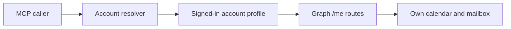
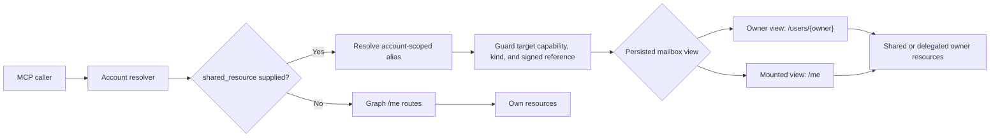
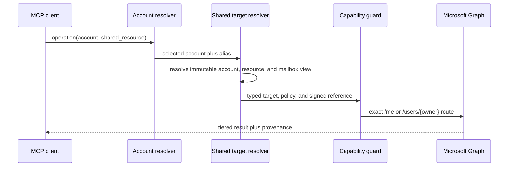

# Per-account shared Outlook resources

## Change Summary

Extend the MCP server so an authenticated account can access explicitly
allowlisted shared or delegated Outlook calendars and mailboxes. Each calendar
alias has its own access profile and each shared mailbox has the independent
mail action policy defined by CR-0068. The account requests the deduplicated
scope union required by its configured targets, while every operation is still
authorized against the exact selected target before a Graph route exists.

Shared resources use immutable internal identities and signed item references.
Owner-primary calendars and shared mailboxes use `/users/{owner}/...`; mounted
calendars remain in the signed-in recipient's `/me` view. The server never
silently reuses identifiers across these views or falls back between them.

Shared sending will remain a separate highest-risk capability. It will require
`Mail.Send.Shared`, Exchange-level Send As or Send on Behalf rights, an existing
draft in the shared mailbox, and the same fail-closed human elicitation control
introduced by CR-0066.

## Motivation and Background

CR-0066 introduced per-account risk profiles for a signed-in user's own mail,
local draft attachments, and confirmed draft sending. The owned Entra
application now also has the following delegated permissions configured:

* `User.Read`
* `Calendars.ReadWrite`
* `Calendars.ReadWrite.Shared`
* `Mail.Read`
* `Mail.Read.Shared`
* `Mail.ReadWrite`
* `Mail.ReadWrite.Shared`
* `Mail.Send`
* `Mail.Send.Shared`

Adding delegated permissions to an Entra application registration makes those
permissions available for consent, but it does not cause the server to request
them and it does not identify which shared mailbox or calendar should be used.
The current server constructs scopes from the account's `MailProfile` and all
calendar and mail handlers call the Graph `/me` request builder.

Microsoft Graph accesses a shared or delegated owner's resources directly by
using `/users/{owner-id-or-upn}/...`. The signed-in account must already have
resource-level sharing, delegation, Send As, or Send on Behalf rights in
Exchange or Outlook. OAuth consent cannot create those rights.

## Change Drivers

* The user has configured all relevant delegated `.Shared` permissions.
* Shared calendars and shared mailboxes are common Microsoft 365 workflows.
* Free-form owner addresses in every tool invocation would be error-prone.
* Shared sending carries a materially different risk from shared reading.
* Per-account scope selection must remain consistent with CR-0066.

## Current State

The authentication subsystem persists one `MailProfile` per account and
constructs scopes for that profile. It always includes `User.Read` and
`Calendars.ReadWrite`; mail scopes are selected from `Mail.Read`,
`Mail.ReadWrite`, and `Mail.Send`.

The account resolver selects the signed-in principal and places its Graph
client, account information, mail profile, and scopes into the request context.
It does not resolve a second identity representing a resource owner.

Calendar and mail handlers use `client.Me()` throughout the tool packages.
Consequently, IDs are interpreted in the signed-in user's mailbox. A shared
custom calendar that Outlook has mounted into the signed-in user's mailbox may
appear through `/me/calendars`, but direct access to an owner's primary calendar
or mailbox is not represented explicitly and cannot be safely selected.

### Current State Diagram



## Proposed Change

Persist an allowlist beneath each account using two explicit alias families:
calendar aliases and mail aliases. Every record has a stable human selector,
an immutable internal identity, one owner, one resource kind, and one mailbox
view. A calendar alias is either an owner-primary calendar in the owner view or
a human-selected mounted calendar in the recipient view. A mail alias denotes
one owner-view mailbox. Owner, kind, and view cannot be edited; retargeting
requires remove and recreate.

Each calendar alias has `off`, `read`, or `manage`. `manage` is available only
for organizational mounted calendars; owner-primary calendars are read-only.
Each mail alias carries the independent action switches defined by CR-0068.
Own and shared mail policies do not constrain one another. OAuth scopes are the
account-wide union required by all configured targets, not the logical
authorization boundary.

Mounted-calendar creation discovers `/me/calendars` for the configured owner
and requires the human to select the exact mounted identity. The server never
infers a calendar, converts an old calendar ID, or silently rebinds a missing
mount.

Calendar and mail verbs in scope will gain an optional `shared_resource`
parameter. Omitting it preserves the existing `/me` behavior. Supplying it
resolves the alias only within the selected signed-in account. The immutable
mailbox view chooses either `client.Me()` for mounted recipient views or
`client.Users().ByUserId(owner)` for owner views.

The API will not expose a free-form `owner` parameter on calendar or mail
verbs. Owners must be configured through account-domain verbs first. This makes
the resource boundary visible, reviewable, auditable, and resistant to an
agent inventing an arbitrary mailbox address.

### Proposed State Diagram



## Requirements

### Functional Requirements

1. Every persisted account **MUST** have an immutable internal account ID in
   addition to its human-facing label and UPN. Migration creates and persists
   one for legacy records.
2. Removing and recreating an account **MUST** create a new internal identity;
   deliberately reusing its label allows selector-based workflows to resolve
   again but **MUST NOT** revive old item references.
3. Every shared resource **MUST** have an immutable internal resource ID and
   exactly one kind: `mailbox`, `owner_primary_calendar`, or
   `mounted_calendar`.
4. Mail and calendar resources **MUST** use separate aliases even when they
   share an owner. Aliases are account-scoped, unique, and validated with the
   existing account-label rules.
5. Alias display names **MAY** be renamed without changing resource identity;
   owner, kind, and mailbox view **MUST** be immutable. Retargeting requires
   removal and recreation with a new identity.
6. `mounted_calendar` creation **MUST** discover the signed-in account's mounted
   calendars for the configured owner and require explicit human selection of
   the exact mounted calendar ID.
7. A missing or invalid mounted calendar **MUST** require re-selection and
   **MUST NOT** be silently rebound.
8. Shared-calendar aliases **MUST** persist `off`, `read`, or `manage`.
9. Shared-calendar `read` **MUST** contribute `Calendars.Read.Shared`; `manage`
   **MUST** contribute `Calendars.ReadWrite.Shared`.
10. `owner_primary_calendar` **MUST** remain read-only. `mounted_calendar`
    management **MUST** be offered only in an organizational token context.
11. Personal and organizational token contexts **MAY** use supported shared-
    calendar reads; unknown contexts **MUST** fail closed to read at most.
12. Every shared-mail alias **MUST** carry the independent mail action policy
    defined by CR-0068 and **MUST NOT** be constrained by the own-mail policy.
13. Personal and unknown token contexts **MUST** fail closed for shared-mail
    operations documented only for work or school tenants.
14. The token tenant context **MUST** be classified from the validated tenant
    ID: Microsoft's fixed consumer tenant is personal, another validated GUID
    is organizational, and missing or invalid tenant data is unknown.
15. Account origin **MUST NOT** be inferred from email shape, tenant name,
    Graph `/me`, or opaque account-ID formatting.
16. Account credentials **MUST** request the deduplicated scope union required
    by all configured own and shared targets.
17. A policy change **MUST** take effect in local authorization immediately.
    Authentication material is cleared only when the deduplicated scope union
    changes; a same-union change **MUST NOT** disconnect the account.
18. A broad retained token **MUST NOT** authorize an action disabled by the
    selected target's local policy.
19. The account domain **MUST** expose discovery, explicit selection, listing,
    renaming, and idempotent removal for the two alias families with text,
    summary, and raw read tiers where applicable.
20. Calendar and mail verbs in scope **MUST** accept an optional account-scoped
    `shared_resource` alias; omitting it **MUST** preserve existing own-resource
    `/me` behavior.
21. Unknown, wrong-kind, incompatible, disabled, or removed targets **MUST**
    fail before route construction or any Graph request.
22. The resolved target **MUST** select one typed SDK user root: `Me()` for own
    and mounted recipient views, or `Users().ByUserId(owner)` for owner views.
    It **MUST NOT** fall back between routes.
23. Shared `respond_event` and `cancel_meeting` **MUST NOT** be exposed until a
    separate meeting-delegation contract is approved.
24. Every shared item result **MUST** include a versioned, self-contained,
    HMAC-signed `resource_ref` binding account ID, resource ID, kind, mailbox
    view, item kind, and the required Graph ID chain.
25. The signing key **MUST** persist across restarts. References have no fixed
    TTL, confer no authority, and **MUST** be revalidated against the current
    account, resource, policy, allowlist, and route on every use.
26. Account removal, resource removal, key rotation, or missing Graph data
    **MUST** invalidate the affected reference.
27. Shared follow-up operations **MUST** require `resource_ref` and **MUST NOT**
    accept a raw Graph ID plus alias. Own-resource raw-ID behavior remains
    backward compatible.
28. Text and summary output **MUST** expose shared references directly. Raw
    output **MUST** preserve Graph JSON and return provenance in a separate
    sidecar rather than altering the Graph shape.
29. Shared send **MUST** accept only a signed reference to an existing draft in
    the selected shared mailbox and require the target's send capability.
30. Its review snapshot **MUST** bind immutable account/resource identities,
    masked account and alias presentation, owner and mailbox view, canonical
    From, `isDraft`, a nonempty `changeKey`, subject, separately normalized
    To/Cc/Bcc multisets, and the complete paged attachment set with ID, name,
    size, content type, and inline status.
31. Missing canonical From, nonempty `changeKey`, recipient, or complete
    attachment evidence **MUST** make send unavailable. The body is not copied
    into elicitation; the user is told to review it in Outlook.
32. Accepted confirmation **MUST** be single-use. Immediately before one POST,
    the server **MUST** re-resolve immutable identities, reauthorize shared send,
    validate the reference, refetch the draft and all attachments, and require
    an exact snapshot match.
33. Declined, timed-out, unsupported, failed, or stale elicitation **MUST** stop
    before dispatch. A model-supplied boolean **MUST NOT** substitute for MCP
    elicitation.
34. Shared send **MUST** make exactly one owner-routed POST and **MUST NOT** be
    retried by the application or SDK for any status.
35. HTTP 202 **MUST** be reported only as accepted for Exchange processing.
    Timeout, cancellation, connection loss, or 5xx after dispatch **MUST** be
    reported as uncertain, never automatically retried, and reconciled by
    inspecting the owner's Drafts and Sent Items before a new reviewed attempt.
36. Sender messaging **MUST** explain that Exchange chooses Send As versus Send
    on Behalf and that the owner Sent Items location is the documented default,
    not an exclusive guarantee.
37. Authorization diagnostics **MUST** distinguish OAuth `.Shared` scopes from
    Exchange sharing, Full Access/folder access, Send As, and Send on Behalf
    without claiming an unobserved exact cause.
38. Read-only mode **MUST** block shared-policy/resource mutation and every
    shared calendar or mail write before Graph.
39. Domain help and status **MUST** expose the effective target compatibility
    and capability matrix while aggregate schemas remain static.
40. Audit records **MUST** use stable identities, masked presentation, counts,
    keyed fingerprints for sensitive review evidence, the Graph request/error
    class, and final outcome; they **MUST NOT** record raw addresses, subjects,
    attachment names, bodies, tokens, authorization headers, bytes, or upload
    URLs unless an explicit masking policy permits it.

### Non-Functional Requirements

1. Shared access **MUST** remain disabled by default.
2. Capability, resource-kind, mailbox-view, account-type, and outcome
   comparisons **MUST** use typed implementations.
3. Per-account credential construction **MUST** request only the deduplicated
   scopes derived from that account's configured target policies.
4. Shared owner identities **MUST NOT** be accepted directly by calendar or mail
   operations.
5. Owner identities in logs and audit output **MUST** use the repository's PII
   masking policy.
6. Tokens, authorization headers, message bodies, attachment bytes, and upload
   URLs **MUST NOT** be logged or persisted in shared resource configuration.
7. Shared route selection **MUST** be isolated in small target-resolution and
   Graph-routing modules rather than duplicated string logic.
8. Existing own-resource behavior and account records **MUST** remain backward
   compatible.
9. The implementation **MUST** use Microsoft Graph v1.0 endpoints.
10. The implementation **MUST** preserve response tiering and write-confirmation
    conventions.

## Supported Operation Matrix

| Resource view | Read | Write | Delivery |
|---|---|---|---|
| Owner-primary calendar | list/get/search events | not supported | not applicable |
| Recipient-mounted calendar | list/get/search events | create, update, reschedule, delete for organizational contexts | not applicable |
| Shared mailbox | independently gated folders, messages, search, conversations, and attachments | independently gated drafts, attachments, move, Archive, trash, restore, and permanent delete per CR-0068 | independently gated send of an existing reviewed draft |

Shared meeting delegation actions such as responding to invitations on behalf
of another user are excluded from this CR because their organizer/delegate
semantics require a separate safety design.

## Affected Components

* `internal/auth` — immutable identities, target policies, token-tenant context,
  scope-union derivation, signing-key persistence, and migration.
* `internal/config` — backward-compatible global defaults if exposed later.
* `internal/tools` — account shared-resource verbs and target-aware handlers.
* `internal/resource` — alias identity, signed references, target resolution,
  authorization, and mailbox-view provenance.
* `internal/graph` — typed `Me()` or owner user-root selection.
* `internal/server` — ordered guards, schemas, annotations, help metadata.
* `internal/audit` — shared target identity fields and masking.
* `extension/manifest.json` — descriptions and any global default inputs.
* `docs/concepts.md` — shared access model and permission boundaries.
* `docs/quickstart.md` — Entra and Exchange sharing prerequisites.
* `docs/troubleshooting.md` — consent, delegation, Send As, and ID mismatch errors.
* `docs/prompts/mcp-tool-crud-test.md` — shared calendar, target-policy, mail
  action, attachment, and send lifecycle.

## Scope Boundaries

### In Scope

* Per-calendar-alias access profiles and per-mail-target action policies.
* Account-scoped allowlisted aliases with immutable identities and signed item
  provenance.
* Explicit owner-view and recipient-mounted Graph routing.
* Shared calendar read and event management.
* Shared mailbox reading, draft management, attachments, and confirmed send.
* Work/school shared mailboxes and delegated calendars.
* Personal-account shared calendar behavior supported by Graph permissions.

### Out of Scope ("Here, But Not Further")

* Application permissions or unattended daemon access.
* Tenant-wide mailbox discovery or enumeration.
* Arbitrary free-form owner targeting on domain verbs.
* Creating Exchange delegation, Send As, or Send on Behalf assignments.
* Sharing invitations or accepting shared calendars through Graph.
* Cross-tenant shared mailboxes.
* Change notifications and subscriptions for shared items.
* Archive mailboxes and public folders.
* Shared contacts, tasks, OneDrive, SharePoint, or Teams resources.
* Meeting response/cancellation on behalf of an owner.
* Automatic detection of every resource shared with the signed-in user.

## Alternative Approaches Considered

### Free-form owner parameter

Rejected because an agent could invent or mistype a mailbox identity on every
call. Graph permission checks reduce but do not remove the targeting risk, and
the intended boundary would not be locally auditable.

### Treat shared mailboxes as accounts

Rejected because a shared mailbox normally has no interactive credential. The
signed-in delegate account supplies the token while the shared mailbox is a
resource target, so conflating them would corrupt the account model.

### Always request every `.Shared` scope

Rejected because it would remove the per-account risk choice established by
CR-0066 and cause broader consent prompts for accounts that do not need shared
access.

### Use only mounted `/me` calendars

Rejected because it does not cover delegated primary calendars or shared
mailboxes consistently, and IDs can differ between owner and recipient views.

## Impact Assessment

### User Impact

Users configure a friendly calendar or mail alias and select it on normal
operations. A capability change requires reauthentication only when it changes
the account's effective OAuth-scope union. Microsoft 365 administrators must
separately grant sharing, delegation, and shared-send rights.

Personal Microsoft accounts can use Graph-supported shared calendar scenarios,
but Microsoft documents shared mail delegated permissions as work/school only.
This limitation must be surfaced rather than hidden behind generic auth errors.

### Technical Impact

The change touches many handlers currently coupled to `client.Me()`. A small
typed target seam will minimize branching and prevent raw URL construction.
The installed `microsoftgraph/msgraph-sdk-go` v1.96.0 source exposes
`GraphBaseServiceClient.Users()` and `UsersRequestBuilder.ByUserId(string)`.

DeepWiki was listed for `microsoftgraph/msgraph-sdk-go` in `.deepwiki` but was
not callable during CR preparation. SDK method availability was therefore
validated against the locally installed v1.96.0 module source. Implementation
must repeat validation if the dependency version changes.

### Business Impact

The feature enables support, finance, team-calendar, executive-delegate, and
other common Microsoft 365 workflows without introducing application-wide
mailbox privileges.

## Implementation Approach

1. Reconcile the governing specifications and add migration/default fixtures.
2. Add immutable identities, signing-key persistence, signed references, and
   deterministic policy migration without exposing shared routes.
3. Add token-tenant classification, scope-union composition, and conditional
   reauthentication.
4. Add discovery, explicit selection, two alias families, and reference issue.
5. Add target authorization, reference validation, typed Graph user-root
   selection, deny-path tests, and real-SDK URL tests before handler migration.
6. Land calendar reads, then permitted mounted-calendar writes.
7. Land shared-mail reads, drafts, small attachments, and separately gated
   large upload sessions.
8. Land CR-0068 reversible mutations, then confirmed permanent deletion.
9. Land shared-send review, confirmation, and one-attempt dispatch last.
10. Update every public contract in the same checkpoint as its surface change;
    finish with full CRUD, `make ci`, snapshot, and live compatibility gates.

### Implementation Flow



## Test Strategy

### Tests to Add

| Test File | Test Name | Description | Inputs | Expected Output |
|---|---|---|---|---|
| `internal/auth/mail_policy_test.go` | `TestScopesUseTargetPolicyUnion` | Exact scope composition | mixed own/shared target policies | exact deduplicated scopes |
| `internal/auth/accounts_test.go` | `TestLegacyAccountsDefaultSharedOff` | Migration safety | record without shared resources | no aliases or shared scopes |
| `internal/resource/authorize_test.go` | `TestSharedCapabilityGuard` | Guard ordering | incompatible, disabled, and enabled targets | deny before route construction or allow |
| `internal/resource/reference_test.go` | `TestSharedReferenceProvenance` | Signed provenance | tampered and cross-target refs | fail closed before Graph |
| `internal/tools/shared_resource_test.go` | `TestSharedAliasLifecycle` | Discover/select/rename/list/remove aliases | account, owner, kind, and view | durable immutable identity lifecycle |
| `internal/tools/shared_resource_test.go` | `TestSharedAliasIsAccountScoped` | Isolation | same alias on two accounts | correct owners remain isolated |
| `internal/graph/resource_target_test.go` | `TestResolveResourceTarget` | Target typing | own, mounted, and owner alias | exact typed user root |
| `internal/tools/list_events_test.go` | `TestListEventsSharedRoutes` | Calendar views | owner-primary and mounted aliases | exact `/users/{owner}` or `/me` route |
| `internal/tools/list_messages_test.go` | `TestListMessagesSharedOwnerRoute` | Mail route | shared alias | `/users/{owner}` called |
| `internal/tools/add_attachment_test.go` | `TestAddAttachmentSharedDraft` | Shared attachment | shared owner draft | verified metadata |
| `internal/tools/send_draft_test.go` | `TestSharedSendRequiresExactConfirmation` | Send safety | shared draft and elicitation | send once only after accept |
| `internal/tools/send_draft_test.go` | `TestSharedSendRejectsStaleDraft` | Version binding | draft changes after review | no send |
| `internal/audit/audit_test.go` | `TestAuditSharedTarget` | Audit contract | shared operation | masked owner and alias recorded |
| `internal/server/shared_schema_test.go` | `TestSharedSchemaIsStatic` | Stable discovery | zero configured aliases | shared parameter still present |

### Tests to Modify

| Test File | Test Name | Current Behavior | New Behavior | Reason for Change |
|---|---|---|---|---|
| `internal/auth/profile_test.go` | `TestScopesForProfile` | own scopes only | migrated policies plus target union | scope contract changes |
| `internal/tools/tool_annotations_test.go` | per-verb help assertions | own-resource semantics | target policy and provenance semantics | public help changes |
| `internal/server/mail_profiles_test.go` | static profile map | own cumulative minimum | static target-capability metadata | new guard axis |
| `docs/prompts/mcp-tool-crud-test.md` | mail/calendar lifecycle | `/me` only | shared calendar, action-policy, attachment, and send cases | integration coverage |

### Tests to Remove

Not applicable. Existing `/me` behavior remains supported and its tests remain
the backward-compatibility suite.

### Live Compatibility Gates

A scenario enters the launch support matrix only after its automated invariants
and one representative tenant-backed contract pass. Release-blocking live
scenarios are personal shared-calendar read with management denied;
organizational owner-primary and mounted reads; organizational mounted
non-meeting writes; shared-mail read, draft lifecycle, and a small attachment;
one missing-Exchange-right negative path; one isolated shared send using either
available sender right; and one confirmed permanent deletion of a disposable
message under CR-0068.

Large shared-mail upload sessions, the untested alternative sender right,
tenant-specific Sent Items behavior, and uncommon Exchange-right combinations
are evidence-limited. A missing or negative result gates or narrows that
scenario and updates the public compatibility matrix; it does not weaken local
authorization or block already verified scenarios. Deterministic transport
tests cover uncertain send outcomes rather than intentionally inducing them in
a live mailbox.

## Acceptance Criteria

### AC-1: Shared access disabled by default

```gherkin
Given an existing account record created before CR-0067
When the server restores the account
Then it has no shared aliases and every migrated shared capability is off
  And no .Shared scopes are requested
```

### AC-2: Exact per-account shared scopes

```gherkin
Given two accounts with different own and shared target policies
When credentials are constructed for both accounts
Then each account requests only its deduplicated target-policy scope union
  And Mail.Send.Shared is present only for shared mail send
```

### AC-3: Allowlisted shared calendar read

```gherkin
Given a signed-in account with read and alias team-calendar
When calendar.list_events selects shared_resource team-calendar
Then Graph uses the alias's immutable owner-primary or mounted mailbox view
  And the result includes a signed resource reference
```

### AC-4: Unknown alias denied locally

```gherkin
Given a signed-in account without alias finance-mail
When a mail operation selects shared_resource finance-mail
Then the operation returns an unknown shared resource error
  And no Graph request is made
```

### AC-5: Shared write profile enforced

```gherkin
Given a calendar alias with read but not manage
When calendar.update_event targets a configured shared calendar
Then the operation identifies manage as the required target capability
  And no Graph route is constructed
```

### AC-6: Shared mailbox draft attachment

```gherkin
Given a shared-mail alias with draft enabled and an allowlisted local file
  And the owner granted mailbox write delegation
When mail.add_attachment targets an existing shared-mailbox draft
Then the upload uses the configured owner route
  And success returns verified attachment and shared target metadata
```

### AC-7: Confirmed shared send

```gherkin
Given an account with shared mail send and Exchange shared-send rights
  And an existing draft in the configured shared mailbox
When the human accepts elicitation for the unchanged draft
Then Graph send is called exactly once through the owner route
  And the result says accepted for Exchange processing
```

### AC-8: Shared send fails closed

```gherkin
Given an existing draft in a configured shared mailbox
When elicitation is declined, unsupported, times out, or the draft changes
Then Graph send is not called
```

### AC-9: Exchange rights remain authoritative

```gherkin
Given a token containing Mail.Send.Shared
  And the signed-in account lacks Exchange Send As or Send on Behalf rights
When shared send is attempted
Then the Graph authorization error explains the relevant Exchange right classes
  And the server neither implies OAuth consent granted delegation nor claims an unobserved exact cause
```

### AC-10: Read-only mode

```gherkin
Given read-only mode is enabled
When a shared policy, alias, calendar write, mail write, or send is requested
Then the operation is rejected before local mutation or Graph mutation
```

### AC-11: Personal-account limitation is visible

```gherkin
Given a personal Microsoft account attempts a work-or-school-only shared mail scope
When authentication or Graph authorization fails
Then troubleshooting guidance identifies the Microsoft account-type limitation
```

### AC-12: Own-resource compatibility

```gherkin
Given a request omits shared_resource
When any existing calendar or mail verb runs
Then it uses the existing me route and response contract
```

## Quality Standards Compliance

### Build and Compilation

- [ ] `make build` passes
- [ ] `make vet` passes
- [ ] No compiler warnings are introduced

### Linting and Code Style

- [ ] `make fmt-check` passes
- [ ] `make lint` passes
- [ ] All new exported symbols have required Go documentation

### Test Execution

- [ ] `make test` passes
- [ ] Shared routing tests prove the owner route and no-Graph denial paths
- [ ] Race-enabled account mutation tests pass

### Documentation

- [ ] Registry help documents all shared parameters and profiles
- [ ] Concepts, quickstart, and troubleshooting are updated
- [ ] CRUD lifecycle prompt covers shared calendar, action-policy, attachment,
  permanent-delete, and send paths
- [ ] `CHANGELOG.md` is not edited manually

### Code Review

- [ ] Changes are submitted through a pull request
- [ ] PR title follows Conventional Commits
- [ ] Standards and specification reviews are completed
- [ ] The PR is squash-merged

### Verification Commands

```bash
make build
make vet
make fmt-check
make tidy
make lint
make test
make sbom
make vuln-scan
make license-check
make ci
```

## Risks and Mitigation

### Risk 1: Agent targets the wrong owner

**Likelihood:** medium
**Impact:** high
**Mitigation:** account-scoped aliases, no free-form owner on resource verbs,
explicit target identity in confirmations and audit records.

### Risk 2: OAuth consent is mistaken for Exchange delegation

**Likelihood:** high
**Impact:** medium
**Mitigation:** documentation and errors distinguish app scopes from sharing,
delegation, Send As, and Send on Behalf rights.

### Risk 3: Shared send uses stale review data

**Likelihood:** low
**Impact:** high
**Mitigation:** bind a complete single-use review snapshot, re-fetch immediately
before dispatch, make one POST, and represent ambiguous outcomes as uncertain.

### Risk 4: Owner-view and recipient-view IDs are mixed

**Likelihood:** medium
**Impact:** high
**Mitigation:** immutable mailbox views, signed references, and one typed
`Me()`/`Users(owner)` selection prevent cross-view reuse and fallback.

### Risk 5: Personal accounts request unsupported mail scopes

**Likelihood:** medium
**Impact:** medium
**Mitigation:** validated token-tenant classification denies personal and
unknown contexts before route construction and provides targeted guidance.

### Risk 6: Broad handler churn introduces regressions

**Likelihood:** medium
**Impact:** high
**Mitigation:** introduce the typed target seam first, migrate operations in
small groups, preserve `/me` tests, and add route-specific contract tests.

## Dependencies

* CR-0066 per-account profiles, attachments, and confirmed send.
* Owned Entra public-client application with the listed delegated permissions.
* Outlook or Exchange sharing/delegation configured by each resource owner.
* Exchange Send As or Send on Behalf assignment for shared sending.
* Microsoft Graph v1.0 shared calendar and shared mail endpoints.
* `microsoftgraph/msgraph-sdk-go` v1.96.0 or a validated compatible version.

## Estimated Effort

* Identity, persistence, signing, migration, and scope composition: 2 to 3 days.
* Discovery, alias lifecycle, target seam, and middleware: 2 to 3 days.
* Calendar route migration and tests: 1 to 2 days.
* Mail routes, attachments, and CR-0068 mutations: 3 to 5 days.
* Permanent-delete and shared-send safety: 2 to 3 days.
* Continuous contract updates, live compatibility gates, and release checks: 2 days.

Estimated total: 12 to 18 engineering days.

## Decision Outcome

Chosen approach: "immutable account-scoped resources, target-local policies,
signed provenance, and explicit mailbox-view routing", because it preserves
least privilege, separates principals from resources, prevents arbitrary or
cross-view targeting, and fits the existing aggregate-domain and multi-account
architecture. CR-0068 is co-governing for mail actions, and the completed
Wayfinder map is binding where it makes this approved CR more specific.

The repository owner's delegated decision process reconciled these approved
requirements with the completed Wayfinder map on 2026-07-20.

## Related Items

* CR-0066 per-account mail profiles, attachments, and send.
* Microsoft Graph shared calendar guidance:
  https://learn.microsoft.com/en-us/graph/outlook-get-shared-events-calendars
* Microsoft Graph shared mail guidance:
  https://learn.microsoft.com/en-us/graph/outlook-share-messages-folders
* Microsoft Graph permission reference:
  https://learn.microsoft.com/en-us/graph/permissions-reference
* Microsoft Graph Go SDK:
  https://github.com/microsoftgraph/msgraph-sdk-go
