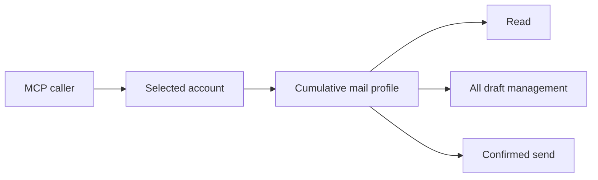
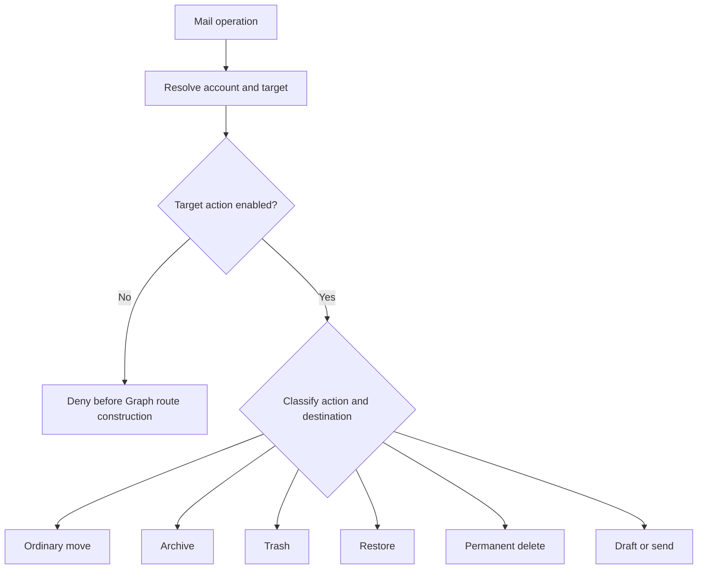
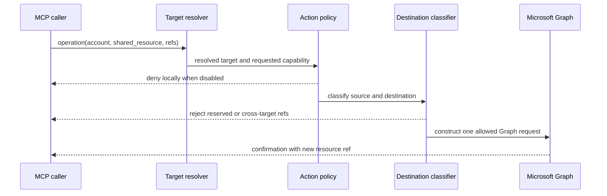

# Granular Mail Action Policies

## Change Summary

Replace cumulative own-mail and shared-mail management tiers with independent,
per-target action policies. Add mail operations for ordinary moves, Archive,
trash, restore, and permanent deletion while retaining separate draft and send
boundaries.

This CR amends CR-0066 and CR-0067. It preserves their per-account and
allowlisted shared-resource model but supersedes requirements that treat mail
management as one cumulative `read`, `manage`, or `send` ladder.

## Motivation and Background

The existing broad `manage` label combines actions with materially different
effects. Preparing a draft does not deliver it. Moving a message to a project
folder does not delete it. Archive is reversible filing, trash changes the
message's deletion lifecycle, and permanent deletion has the highest data-loss
risk.

The repository owner requires logical blocking for each signed-in account and
each individual shared mailbox alias. If an action is disabled for the selected
target, the MCP must not expose that action as available for the target and must
fail before constructing the corresponding Graph request.

Microsoft Graph uses `Mail.ReadWrite` for all message mutations, so OAuth scopes
cannot express these distinctions. The MCP policy layer is therefore the
enforcement boundary. A stolen token retains the union of Microsoft-granted
scopes; these local controls do not claim to provide token isolation.

## Change Drivers

* Agents must be able to prepare drafts without gaining send authority.
* Agents must be able to file mail without gaining deletion authority.
* Archive and trash must not be smuggled through an ordinary destination ID.
* Recovery must be independently allowlisted from general mailbox movement.
* Permanent deletion must be disabled by default and visibly distinct.
* Own mail and each shared mailbox need independent risk profiles.
* CR-0067's account-wide shared tier is too coarse for the desired controls.

## Current State

CR-0066 persists one cumulative own-resource mail profile per account:
`mail_disabled`, `mail_read`, `mail_manage`, or `mail_send`. Draft and attachment
operations require manage or send, while confirmed delivery requires send.

Approved CR-0067 proposed a second cumulative shared-mail profile with values
`none`, `read`, `manage`, or `send`. It also required the shared profile not to
exceed the own-resource profile.

The current MCP exposes mail reading, draft lifecycle, local draft attachment,
and confirmed draft sending. It does not expose received-message move, Archive,
trash, restore, or permanent-delete operations.

CR-0058 explicitly deferred received-message organization and metadata
management. This CR brings only message filing and deletion lifecycle actions
into scope; category, flag, and read-state mutations remain deferred.

### Current State Diagram



## Proposed Change

Persist an independent mail action policy for the signed-in account's own
mailbox and for every shared-mail alias. A policy contains these logical
capabilities:

| Capability | Permitted MCP behavior | Graph scope contribution |
| --- | --- | --- |
| `read` | List, search, and retrieve mail, folders, conversations, and attachments | `Mail.Read` or `.Shared` equivalent |
| `draft` | Create, reply, forward, edit, attach to, and delete drafts without delivery | `Mail.ReadWrite` or `.Shared` equivalent |
| `move` | Move a non-draft message to an ordinary allowed folder | `Mail.ReadWrite` or `.Shared` equivalent |
| `archive` | Move a non-draft message to the well-known Archive folder | `Mail.ReadWrite` or `.Shared` equivalent |
| `trash` | Move a non-draft message to the well-known Deleted Items folder | `Mail.ReadWrite` or `.Shared` equivalent |
| `restore` | Move a message from Deleted Items to an ordinary allowed folder | `Mail.ReadWrite` or `.Shared` equivalent |
| `permanent_delete` | Invoke Graph permanent deletion for an eligible message | `Mail.ReadWrite` or `.Shared` equivalent |
| `send` | Deliver an existing draft after fail-closed human elicitation | `Mail.ReadWrite` plus `Mail.Send`, or `.Shared` equivalents |

The switches are logically independent. Enabling one does not register or
authorize another. The account's OAuth scopes remain the union needed by every
enabled own and shared target.

### Graph Action Classification

Graph v1.0 exposes a shared `POST .../move` action for ordinary moves, Archive,
trash-by-destination, and restoration. Archive and Deleted Items are well-known
folder destinations. The MCP must resolve and classify the destination before
building the request, and ordinary move must reject reserved deletion and
Archive destinations.

The MCP will use a semantic `trash_message` operation that moves to the
well-known Deleted Items folder. It will not use an ambiguous caller-selected
destination to represent deletion. Permanent deletion uses Graph's distinct
`POST .../permanentDelete` action.

Moves create a destination copy and remove the source. The returned destination
message and its new shared resource reference become authoritative. Callers
must not continue using the pre-move reference.

### Proposed State Diagram



## Requirements

### Functional Requirements

#### Policy model

1. Every signed-in account **MUST** persist an own-mail action policy containing the eight capabilities defined by this CR.
2. Every shared-mail alias **MUST** persist its own action policy containing the same eight capabilities.
3. Every capability **MUST** be independently enabled or disabled for each target.
4. Enabling one capability **MUST NOT** implicitly enable another capability in the MCP policy.
5. New accounts and new shared-mail aliases **MUST** default every mail capability to disabled.
6. `permanent_delete` **MUST** default to disabled under every configuration path.
7. Own-mail policy and shared-mail alias policy **MUST NOT** constrain one another.
8. Target policy **MUST** be checked before constructing `/me` or `/users/{owner}` Graph routes.
9. A denied action **MUST** identify the account, target alias when applicable, requested capability, and local policy reason without making a Graph request.
10. Account status and help output **MUST** display the effective action matrix for each own and shared-mail target.

#### Backward-compatible migration

11. Existing `mail_disabled` records **MUST** migrate with every capability disabled.
12. Existing `mail_read` records **MUST** migrate with only `read` enabled.
13. Existing `mail_manage` records **MUST** migrate with `read` and `draft` enabled.
14. Existing `mail_send` records **MUST** migrate with `read`, `draft`, and `send` enabled.
15. Migration **MUST NOT** enable `move`, `archive`, `trash`, `restore`, or `permanent_delete` for an existing record.
16. The legacy profile input **MUST** remain accepted for a documented transition period and map deterministically to the preceding policies.
17. Persisted policy writes **MUST** use the new action-policy representation after migration.

#### OAuth scope composition

18. An account with no enabled mail capability across all targets **MUST NOT** request a mail scope.
19. A target with only `read` enabled **MUST** contribute the corresponding `Mail.Read` scope.
20. Any enabled draft, move, archive, trash, restore, or permanent-delete capability **MUST** contribute the corresponding `Mail.ReadWrite` scope.
21. An enabled send capability **MUST** contribute `Mail.ReadWrite` and `Mail.Send` for the relevant own or shared resource class.
22. Account credentials **MUST** request the deduplicated union of scopes required by every configured target.
23. Personal and unknown token contexts **MUST** fail closed for shared-mail capabilities documented only for organizational tenants.
24. A policy change that increases or decreases required scopes **MUST** disconnect the account and clear its local authentication material before another Graph call.
25. A policy change that leaves the account's deduplicated scope union unchanged **MUST** take effect immediately without disconnecting the account.
26. A token scope retained because another target still requires it **MUST NOT** authorize an action disabled by the selected target's local policy.

#### Draft and send separation

27. Draft creation, reply draft, forward draft, draft update, draft attachment, and draft deletion **MUST** require only the selected target's `draft` capability.
28. Draft operations **MUST NOT** expose or invoke a send route when `send` is disabled.
29. Sending **MUST** require the selected target's `send` capability independently of `draft`.
30. Send **MUST** require an existing draft and the complete single-use review,
    exact revalidation, one-attempt dispatch, and uncertain-outcome contract in
    CR-0067.
31. Send **MUST NOT** accept a model-supplied confirmation boolean.
32. Send **MUST NOT** retry an ambiguous Graph delivery failure.

#### Message move

33. The mail domain **MUST** add a `move_message` verb.
34. `move_message` **MUST** require the selected target's `move` capability.
35. `move_message` **MUST** accept a target-bound message reference and a target-bound destination folder reference.
36. `move_message` **MUST** resolve the destination folder before request construction.
37. `move_message` **MUST** reject Archive, Deleted Items, recoverable-items, Purges, Drafts, Outbox, and any other reserved non-ordinary destination.
38. `move_message` **MUST** reject a destination from a different account, shared alias, owner view, or mailbox.
39. `move_message` **MUST** return the destination message's new reference from Graph's `201 Created` response.

#### Archive

40. The mail domain **MUST** add an `archive_message` verb.
41. `archive_message` **MUST** require the selected target's `archive` capability.
42. `archive_message` **MUST** use the well-known `archive` destination rather than accept a caller-supplied folder ID.
43. `archive_message` **MUST** describe Outlook One-Click Archive and **MUST NOT** claim to target the separate Exchange Online Archive Mailbox.
44. `archive_message` **MUST** return the moved message's new reference.

#### Trash

45. The mail domain **MUST** add a `trash_message` verb.
46. `trash_message` **MUST** require the selected target's `trash` capability.
47. `trash_message` **MUST** use the well-known `deleteditems` destination.
48. `trash_message` **MUST NOT** accept an arbitrary destination.
49. `trash_message` **MUST** return the message's new Deleted Items reference.
50. Ordinary move **MUST NOT** provide an alternate path to `deleteditems`.

#### Restore

51. The mail domain **MUST** add a `restore_message` verb.
52. `restore_message` **MUST** require the selected target's `restore` capability.
53. `restore_message` **MUST** verify that the source message is currently in Deleted Items.
54. `restore_message` **MUST** accept only an ordinary target-bound destination folder reference.
55. `restore_message` **MUST** reject Archive and deletion-class destinations.
56. `restore_message` **MUST** return the restored message's new reference.
57. The MCP **MUST NOT** promise restoration from `recoverableitemsdeletions` without a separately verified Graph v1.0 contract.

#### Permanent deletion

58. The mail domain **MUST** add a `permanent_delete_message` verb.
59. `permanent_delete_message` **MUST** require the selected target's `permanent_delete` capability.
60. `permanent_delete_message` **MUST** use Graph's distinct `permanentDelete` action.
61. `permanent_delete_message` **MUST** be marked destructive and idempotent in per-verb help metadata because repeating the same target cannot delete an additional resource.
62. `permanent_delete_message` **MUST** state that Outlook clients cannot recover the message and that mailbox retention or legal hold may still apply.
63. Every permanent deletion **MUST** require fresh MCP human elicitation in
    addition to explicit per-target enablement.
64. Elicitation **MUST** show the signed-in account, shared alias and masked
    owner when applicable, message identity with useful masked context, and an
    explicit permanent-and-not-recoverable warning.
65. Confirmation **MUST** be single-use and bind the exact target and message
    reference. It **MUST NOT** be supplied by the model, reused, or applied to a
    batch.
66. Immediately before one Graph request, the server **MUST** reauthorize the
    target capability and revalidate the signed reference.
67. Declined, timed-out, unsupported, failed, stale, or mismatched elicitation
    **MUST** stop before dispatch.
68. Permanent deletion **MUST NOT** be retried automatically. An ambiguous
    post-dispatch timeout, cancellation, connection loss, or 5xx **MUST** be
    reported as uncertain and reconciled through mailbox inspection before a
    separately reviewed attempt.
69. Read-only mode **MUST** block every operation added by this CR.

#### Shared-target and reference safety

70. Every new operation **MUST** accept the existing optional account selector and shared-resource alias selector.
71. Every new shared operation **MUST** use CR-0067's authorized immutable
    target and exact owner route rather than a caller-supplied identity.
72. Every message and folder reference **MUST** be bound to its signed-in account, target identity, resource kind, and mailbox view.
73. A reference from one target **MUST NOT** be used on another target.
74. Raw Graph IDs **MUST NOT** bypass shared target provenance checks.
75. Audit records **MUST** include the selected account, target, capability, source reference, destination classification when applicable, confirmation state for permanent deletion, Graph request/error class, and outcome using the masking rules in CR-0067.

#### Tool surface and documentation

76. New behavior **MUST** be added as verbs of the existing aggregate `mail` tool.
77. The static aggregate schema **MUST** remain independent of connected accounts and configured targets.
78. Domain help **MUST** describe each operation's policy requirement and destructive semantics.
79. Target-specific status **MUST** indicate which operations are unavailable without removing them from the aggregate schema.
80. `docs/prompts/mcp-tool-crud-test.md` **MUST** exercise every new operation and its denied path.
81. `extension/manifest.json` **MUST** remain synchronized with the aggregate tool surface and description.
82. Registry help, manifest text, embedded concepts or troubleshooting guidance
    where relevant, CRUD prompts, and their contract tests **MUST** change in the
    same checkpoint as the public verb, schema, capability, or behavior they
    describe.

### Non-Functional Requirements

1. Policy enforcement **MUST** occur before Graph route construction.
2. Destination classification **MUST** be centralized in a small typed module.
3. New handlers **MUST** be placed in separate single-purpose files under `internal/tools`.
4. All packages, types, methods, functions, and exported fields **MUST** include the documentation required by `AGENTS.md`.
5. Graph calls **MUST** use the repository timeout, retry, error, audit, and observability layers.
6. Non-idempotent or destructive operations **MUST NOT** be retried after an ambiguous response.
7. Response output **MUST** follow the three-tier read model and text-confirmation write model.
8. Logs **MUST NOT** contain message bodies, recipient lists, tokens, authorization headers, or unmasked owner identities.
9. Policy mutation **MUST** be concurrency-safe and persistence-safe.
10. Existing own-resource read, draft, attachment, and send workflows **MUST** remain backward compatible after migration.

## Affected Components

* `internal/auth` — policy persistence, migration, scope union, token-context compatibility.
* `internal/config` — legacy profile mapping and secure defaults.
* `internal/graph` — typed destination classification and target-aware builders.
* `internal/tools` — five new mail verbs and per-verb capability guards.
* `internal/server` — static schemas, annotations, help, and middleware ordering.
* `internal/audit` — target, action, destination class, and outcome fields.
* `extension/manifest.json` — aggregate mail description synchronization.
* `docs/concepts.md` — independent action-policy and OAuth-union explanation.
* `docs/quickstart.md` — policy configuration examples.
* `docs/troubleshooting.md` — target rights, invalid destinations, and stale references.
* `docs/prompts/mcp-tool-crud-test.md` — new operation lifecycle and deny-path coverage.

## Scope Boundaries

### In Scope

* Independent action policies for own mail and every shared-mail alias.
* Deterministic migration from CR-0066 profiles.
* Ordinary move to an explicitly selected folder.
* Outlook One-Click Archive.
* Move to Deleted Items as the semantic trash operation.
* Restore from Deleted Items to an ordinary folder.
* Graph permanent deletion, disabled by default.
* Target-bound message and folder references.
* Work/school shared-mail routes already governed by CR-0067.

### Out of Scope ("Here, But Not Further")

* Exchange Online Archive Mailbox operations.
* Recovery from the hidden recoverable-items folders.
* Retention policy, legal hold, eDiscovery, or compliance administration.
* Creating, renaming, moving, or deleting mail folders.
* Mark-read, flag, importance, and category mutations.
* Junk, phishing, block-sender, sweep, or mailbox-rule operations.
* Cross-mailbox moves or copies.
* Bulk mutation endpoints.
* Application permissions or unattended daemon access.
* Free-form owner identities or raw unclassified destination IDs.

## Alternative Approaches Considered

### Retain cumulative profiles

Rejected because `manage` grants unrelated actions and cannot express draft
without move, move without deletion, or Archive without permanent deletion.

### Depend on OAuth scopes

Rejected because Graph uses `Mail.ReadWrite` for these message mutations. OAuth
cannot distinguish ordinary filing from destructive deletion.

### Use one generic move operation

Rejected because Archive and Deleted Items are valid `/move` destinations. A
generic destination would let callers bypass separate policy gates.

### Fold restore into move

Rejected because the repository owner explicitly requires restore to be an
independent per-target capability.

## Impact Assessment

### User Impact

Users gain precise risk choices for each account and shared mailbox. Existing
profiles migrate without gaining new actions. Configuration becomes more
verbose, but status output will show the effective matrix and legacy inputs
remain temporarily accepted.

### Technical Impact

The cumulative `MinimumProfile` comparison is insufficient and must become a
typed capability check. Graph scope construction changes from one account tier
to the union of every own and shared target policy. Move results require new
references, so callers and tests must not assume the source reference remains
valid.

### Business Impact

The change enables controlled mail triage and filing workflows for individual,
team, finance, support, and delegated mailboxes without forcing users to accept
the full risk of send or deletion.

## Implementation Approach

1. Introduce typed mail capabilities and policy sets.
2. Add deterministic legacy-profile migration.
3. Compose OAuth scopes from the account's target-policy union.
4. Add target-aware message and folder reference validation.
5. Add centralized destination classification.
6. Implement ordinary move and Archive.
7. Implement trash and restore.
8. Implement permanent deletion with destructive metadata, fresh single-use
   elicitation, immediate target/reference revalidation, one-attempt dispatch,
   and an uncertain outcome.
9. Replace cumulative mail guards with exact per-target action guards.
10. Update status, help, manifest, audit, documentation, CRUD coverage, and
    contract tests in the same checkpoint as each public change.

### Implementation Flow



## Test Strategy

### Tests to Add

| Test File | Test Name | Description | Inputs | Expected Output |
| --- | --- | --- | --- | --- |
| `internal/auth/mail_policy_test.go` | `TestLegacyMailProfileMigration` | Exact legacy mapping | all CR-0066 profiles | no new filing capability enabled |
| `internal/auth/mail_policy_test.go` | `TestTargetPoliciesAreIndependent` | Own/shared isolation | different target switches | exact target matrices |
| `internal/auth/mail_policy_test.go` | `TestScopesUsePolicyUnion` | Scope composition | mixed targets | exact deduplicated scopes |
| `internal/tools/move_message_test.go` | `TestMoveMessageOrdinaryFolder` | Normal filing | valid same-target refs | one `/move`, new ref |
| `internal/tools/move_message_test.go` | `TestMoveRejectsReservedDestination` | Bypass prevention | Archive/Deleted Items refs | local denial, no Graph |
| `internal/tools/archive_message_test.go` | `TestArchiveUsesWellKnownDestination` | Archive classification | message ref | destination `archive` |
| `internal/tools/trash_message_test.go` | `TestTrashUsesDeletedItems` | Trash classification | message ref | destination `deleteditems` |
| `internal/tools/restore_message_test.go` | `TestRestoreFromDeletedItems` | Recovery | deleted message + folder | ordinary destination, new ref |
| `internal/tools/restore_message_test.go` | `TestRestoreRejectsNonDeletedSource` | Source validation | inbox message | local denial, no Graph |
| `internal/tools/permanent_delete_message_test.go` | `TestPermanentDeleteDisabledByDefault` | Secure default | default policy | local denial |
| `internal/tools/permanent_delete_message_test.go` | `TestPermanentDeleteExactTarget` | Destructive route | enabled matching target | one permanent-delete call |
| `internal/tools/permanent_delete_message_test.go` | `TestPermanentDeleteRequiresFreshConfirmation` | Human safety gate | declined, stale, reused, and accepted elicitation | no call or exactly one call |
| `internal/tools/permanent_delete_message_test.go` | `TestPermanentDeleteAmbiguousOutcome` | Post-dispatch uncertainty | timeout, cancellation, connection loss, and 5xx | uncertain, no retry |
| `internal/tools/mail_target_policy_test.go` | `TestEveryMailActionDeniedBeforeRoute` | Guard ordering | disabled switches | zero Graph requests |
| `internal/tools/mail_target_policy_test.go` | `TestSharedAliasesHaveIndependentPolicies` | Alias isolation | two aliases | exact allowed action only |
| `internal/tools/mail_reference_test.go` | `TestMovedMessageReturnsNewReference` | ID lifecycle | Graph move response | old ref not returned as current |
| `internal/tools/tool_annotations_test.go` | `TestMailMutationAnnotations` | Metadata | five verbs | exact annotation matrix |

### Tests to Modify

| Test File | Test Name | Current Behavior | New Behavior | Reason for Change |
| --- | --- | --- | --- | --- |
| `internal/auth/profile_test.go` | profile scope tests | cumulative own profile | legacy mapping plus policy union | persistence model changes |
| `internal/tools/dispatch_test.go` | mail profile guard tests | `MinimumProfile` ordering | exact target capability | guard contract changes |
| `internal/tools/status_test.go` | mail profile display | one tier per account | target action matrix | user-visible configuration |
| `internal/tools/send_draft_test.go` | send authorization | cumulative send profile | exact target send switch | independent boundary |
| `internal/tools/create_draft_test.go` | draft authorization | manage or send | exact target draft switch | independent boundary |
| `docs/prompts/mcp-tool-crud-test.md` | mail lifecycle | read/draft/send only | filing, recovery, denial | harness coupling |

### Tests to Remove

No behavioral test is removed. Tests that assert cumulative profile ordering
must be rewritten as exact capability assertions rather than deleted, because
their security intent remains relevant.

## Acceptance Criteria

### AC-1: Existing accounts gain no new filing authority

```gherkin
Given an account persisted with the legacy mail_manage profile
When the account record is migrated
Then read and draft are enabled
  And move, archive, trash, restore, permanent_delete, and send are disabled
```

### AC-2: Draft does not imply send

```gherkin
Given a target with draft enabled and send disabled
When an agent creates or edits a draft
Then the draft operation succeeds
  And a send attempt is denied before Graph route construction
```

### AC-3: Ordinary move cannot bypass Archive or trash gates

```gherkin
Given a target with move enabled and archive and trash disabled
When move_message receives an Archive or Deleted Items destination
Then the operation is rejected locally
  And Graph receives no request
```

### AC-4: Shared aliases are independent

```gherkin
Given finance-mail allows draft and support-mail allows move
When draft targets support-mail and move targets finance-mail
Then both operations are denied locally
  And the inverse operations are allowed subject to Exchange rights
```

### AC-5: Archive has one semantic destination

```gherkin
Given archive is enabled for the selected target
When archive_message is invoked
Then Graph move is called with the well-known archive destination
  And the response returns the destination message reference
```

### AC-6: Trash is distinct from permanent deletion

```gherkin
Given trash is enabled and permanent_delete is disabled
When trash_message is invoked
Then the message moves to Deleted Items
  And no permanent-delete action is constructed
```

### AC-7: Restore is independently gated

```gherkin
Given restore is enabled and move is disabled
  And the message is currently in Deleted Items
When restore_message targets an ordinary folder
Then the restore succeeds through the classified move action
  And general move remains unavailable
```

### AC-8: Permanent deletion is disabled by default

```gherkin
Given a new account or shared-mail alias
When permanent_delete_message is requested
Then the operation is denied by local policy
  And Graph receives no permanent-delete request

When permanent_delete is explicitly enabled for the exact target
  And the user freshly confirms the exact message after the permanent warning
Then the capability and signed reference are revalidated immediately
  And Graph receives exactly one permanent-delete request
  And the confirmation cannot be reused or applied to another message

When the post-dispatch outcome is ambiguous
Then the result is uncertain rather than success or failure
  And the server does not retry automatically
```

### AC-9: Cross-target references fail closed

```gherkin
Given a message reference from one shared mailbox alias
When any mutation targets another alias
Then reference validation fails before Graph route construction
```

### AC-10: Scope union does not change logical authorization

```gherkin
Given one alias requires Mail.ReadWrite.Shared
  And another alias has only read enabled
When a write operation targets the read-only alias
Then the operation is denied locally despite the token's broader union scope
```

### AC-11: Personal shared mail fails closed

```gherkin
Given the validated token tenant is the Microsoft consumer tenant
When any shared-mail action is requested
Then the operation is denied as incompatible before Graph route construction
```

### AC-12: Quality checks pass

```gherkin
Given the implementation and documentation are complete
When make ci is executed
Then build, vet, formatting, tidy, lint, tests, SBOM, vulnerability, and license checks pass
```

### AC-13: Representative live deletion gate

```gherkin
Given a dedicated test mailbox and a disposable message
  And permanent_delete is temporarily enabled only for that target
When the live release verification obtains fresh human confirmation
Then exactly that disposable message is submitted once for permanent deletion
  And the capability is disabled again after verification
```

## Quality Standards Compliance

### Build and Compilation

- [ ] `make build` passes
- [ ] `make vet` passes
- [ ] No compiler warnings are introduced

### Linting and Code Style

- [ ] `make fmt-check` passes
- [ ] `make lint` passes with documented exceptions only
- [ ] All new symbols have required Go documentation

### Test Execution

- [ ] Existing tests pass
- [ ] New unit and integration tests pass
- [ ] Race-enabled tests cover policy mutation and resolution

### Documentation

- [ ] Registry help is the per-verb source of truth
- [ ] Concepts, quickstart, and troubleshooting are updated
- [ ] CRUD lifecycle covers every new operation
- [ ] `CHANGELOG.md` is not manually edited

### Code Review

- [ ] Changes are submitted through a pull request
- [ ] PR title follows Conventional Commits
- [ ] Standards and specification reviews complete
- [ ] The PR is squash-merged

### Verification Commands

```bash
make build
make vet
make fmt-check
make tidy
make lint
make test
make sbom
make vuln-scan
make license-check
make ci
```

## Risks and Mitigation

### Risk 1: Ordinary move bypasses destructive gates

**Likelihood:** medium
**Impact:** high
**Mitigation:** Resolve destination references and reject reserved destinations
before constructing `/move`.

### Risk 2: Broad OAuth token is mistaken for local authorization

**Likelihood:** high
**Impact:** high
**Mitigation:** Check exact target policy on every operation and document that
scope union is not token isolation.

### Risk 3: Stale identifiers target the wrong post-move resource

**Likelihood:** medium
**Impact:** medium
**Mitigation:** Return a new signed resource reference from Graph's destination
message and never silently reuse the source reference.

### Risk 4: Permanent deletion causes irreversible loss

**Likelihood:** low
**Impact:** high
**Mitigation:** Disable it by default, require fresh target-bound elicitation,
revalidate immediately before one non-retried request, represent ambiguous
outcomes as uncertain, and live-test only a disposable dedicated-mailbox item.

### Risk 5: Migration grants unintended authority

**Likelihood:** low
**Impact:** high
**Mitigation:** Map legacy profiles only to operations that existed under those
profiles; never enable newly introduced filing or deletion actions.

## Dependencies

* CR-0066 per-account profiles, attachments, and confirmed send.
* CR-0067 shared Outlook resources and target identity.
* The signed resource-reference and destination-provenance decisions in the
  shared Outlook Wayfinder map.
* Microsoft Graph v1.0 message move and permanent-delete endpoints.
* `microsoftgraph/msgraph-sdk-go` v1.96.0 generated builders validated by the
  associated research ticket.

## Estimated Effort

* Policy model, persistence, and migration: 1 to 2 days.
* Scope union and exact target guards: 1 day.
* Message/folder references and destination classifier: 1 to 2 days.
* Five new verbs, permanent-delete elicitation, and tests: 3 to 4 days.
* Continuous status, audit, public-contract, CRUD, and live-gate work: 1 to 2 days.

Estimated total: 7 to 11 engineering days in addition to shared CR-0067
infrastructure.

## Decision Outcome

Chosen approach: "independent per-target mail action policies with semantic
message-operation verbs", because it permits drafting without sending, filing
without deletion, recovery without general movement, and secure defaults for
permanent deletion even though Microsoft Graph uses broad shared scopes and a
common move endpoint. Permanent deletion additionally requires fresh,
target-bound human elicitation, immediate revalidation, exactly one request,
and explicit uncertainty after an ambiguous dispatch.

Approval was explicitly provided by the repository owner on 2026-07-20.
The repository owner's delegated decision process reconciled permanent-delete
elicitation, rollout, and verification requirements on the same date.

## Related Items

* CR-0058: draft-centric mail management; received-message organization was deferred.
* CR-0066: per-account mail profiles, attachments, and confirmed send.
* CR-0067: per-account shared Outlook resources.
* `docs/wayfinder/tickets/verify-mail-move-delete-archive-graph-contract.md`.
* Microsoft Graph v1.0 message move documentation.
* Microsoft Graph v1.0 message permanent-delete documentation.
