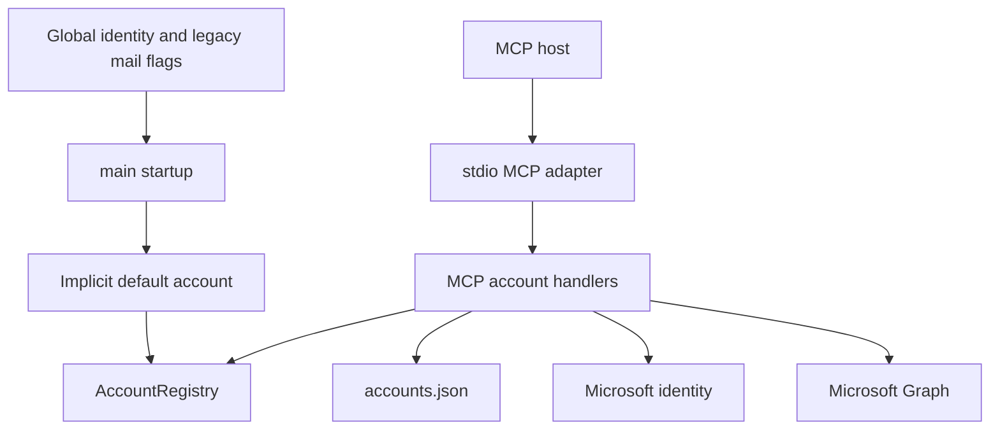
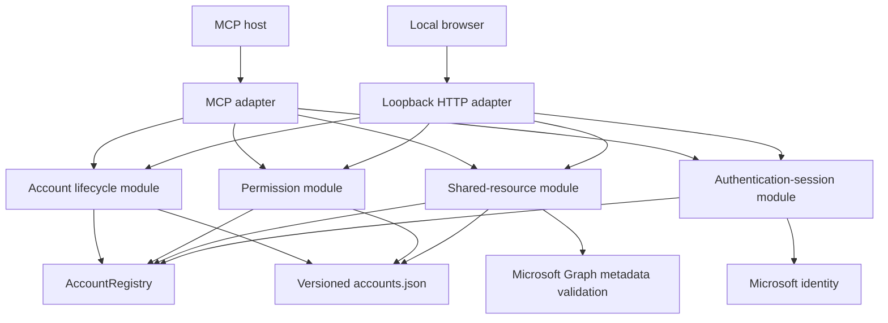
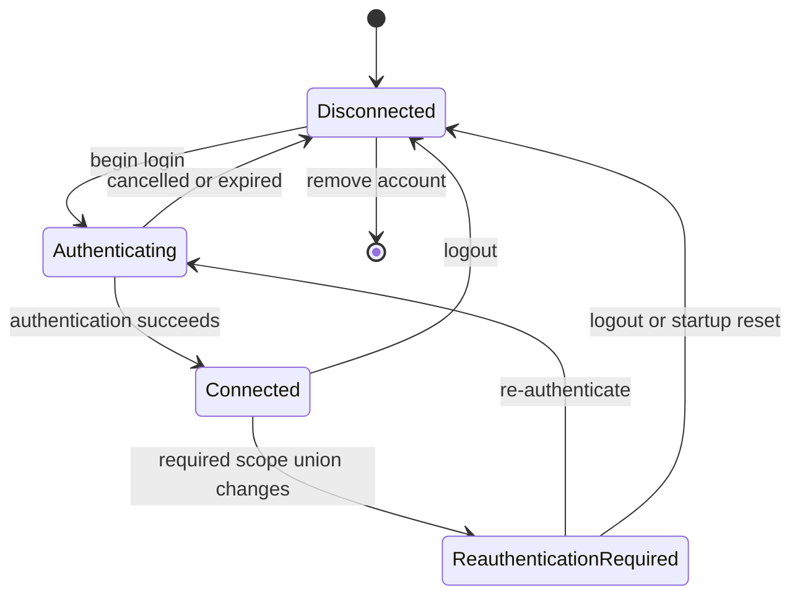
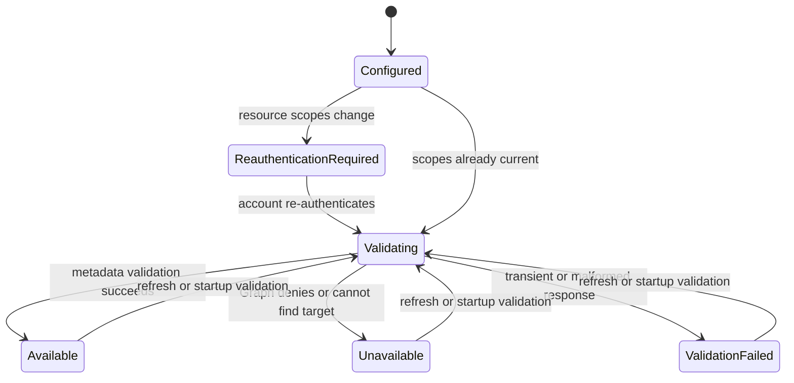
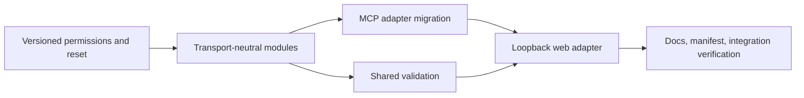

# Local Web Account Administration and Explicit Permissions

## Change Summary

Add an optional, lightweight account-administration web UI to the existing Go
binary. The UI will run on a loopback-only HTTP listener beside the stdio MCP
transport and will expose the same account lifecycle, permission, shared-resource,
validation, and authentication behavior as the MCP `account` domain.

The change also replaces inherited global calendar and mail permissions with an
explicit per-account policy model. This is an intentional breaking permission
reset: existing account identities and resource configuration are retained, but
cached authentication is cleared and every account must review its permissions
and re-authenticate once.

## Motivation and Background

Account administration has outgrown the original terminal- and elicitation-only
workflow. The current account domain manages multiple authentication methods,
independent own-mail permissions, shared calendar aliases, shared mailbox aliases,
immutable resource identities, token-tenant evidence, and a deterministic OAuth
scope union. These controls are powerful but difficult to inspect and configure
through individual MCP calls.

A local web page can present the complete state of one account in one place:
identity, connection state, local permissions, active scopes, required scopes,
shared resources, validation status, and re-authentication progress. The project
is already a single Go binary, so the standard library can provide this interface
without Node.js, a frontend build chain, or a second runtime.

The feature must not create a second implementation of account rules. Current
MCP handlers mix transport concerns such as `mcp.CallToolRequest`, elicitation,
text formatting, middleware, and notifications with persistence, registry,
authentication, and scope-transition logic. Adding HTTP handlers directly over
those handlers, or copying their logic, would produce divergent safety behavior.
The account behavior therefore needs a transport-neutral module seam with MCP and
HTTP as separate adapters.

The current permission baseline also deserves correction. `User.Read` and
`Calendars.ReadWrite` are hard-coded into every account because the application
began as a calendar-first MCP. `User.Read` remains foundational for signed-in
identity resolution. `Calendars.ReadWrite` is not foundational: an account may
need no own-calendar access, read-only own-calendar access, or management access.
This CR makes that choice explicit.

## Change Drivers

* Users need a compact visual surface for multi-account authentication state.
* Granular mail and shared-resource policies need an understandable editor.
* Scope-changing policy edits need a visible re-authentication workflow.
* Shared-resource discovery and validation need refresh and manual fallback paths.
* Optional own-calendar access is required for least-privilege authentication.
* MCP and web administration must enforce identical transactions and safety rules.
* The single-binary distribution must remain lightweight and self-contained.

## Current State

The application is a Go 1.25 binary serving MCP through stdio. It has no
production HTTP listener, HTML templates, embedded web assets, or CLI argument
parser. Configuration is loaded from environment variables.

`cmd/outlook-local-mcp/main.go` performs authentication setup, registry creation,
implicit default-account registration, account restoration, MCP registration,
and blocking stdio transport startup in one lifecycle.

The account domain currently provides lifecycle, policy, and alias operations:

* add, list, login, logout, refresh, and remove account;
* set independent own-mail action policy;
* legacy cumulative mail-profile transition operations;
* discover, add, list, rename, remove, reselect, and set policy for calendar aliases;
* add, list, rename, remove, and set policy for shared-mail aliases.

Every account currently receives `User.Read` and `Calendars.ReadWrite`. Optional
mail and shared-resource scopes are unioned with those base scopes. Own-calendar
verbs do not have an account-local `off`, `read`, or `manage` policy guard.

An implicit `default` account may be created from global environment identity
configuration. Legacy global mail flags still influence that account and legacy
records. New explicitly added accounts can use the legacy `mail_profile` input,
while the newer independent mail policy is the authoritative runtime model.

Shared mounted calendars are selected from `/me/calendars` discovery. Shared
mailboxes and owner-primary calendars use manually supplied owners. The runtime
does not maintain one consistent validation state model across all shared
resources, and no startup job validates resource reachability.

### Current State Diagram



## Proposed Change

Introduce transport-neutral account-administration modules whose interfaces are
used by both the existing MCP account tool and a new loopback web adapter. The
modules own account transactions, explicit policies, authentication sessions,
scope comparison, re-authentication state, shared-resource validation, and
structured outcomes. Adapters own request decoding, response rendering, HTTP or
MCP security, and transport-specific presentation.

The web UI will be disabled by default. When enabled, it will bind only to
`127.0.0.1`, default to port `8155`, share the stdio process lifetime, and never
open a browser automatically. A bind failure will disable the UI for that run
without taking down the MCP transport.

The UI will be one server-rendered page with expandable account cards. Minimal
embedded CSS and vanilla JavaScript will provide immediate permission updates,
authentication-session polling, shared-resource refresh, and inline outcomes.
There will be no external web assets or frontend build toolchain.

Each account will have an exact own-calendar policy (`off`, `read`, or `manage`)
and an independent own-mail action policy. `User.Read` will remain mandatory.
Own-calendar `off` contributes no own-calendar scope, `read` contributes
`Calendars.Read`, and `manage` contributes `Calendars.ReadWrite`. Shared scopes
remain independent and arise only from configured shared-resource policies.

Permission edits will persist immediately. If the required OAuth scope union
changes, cached authentication will be cleared and the persisted account will be
marked `re_authentication_required`. If the scope union does not change, local
authorization will change immediately without unnecessary authentication.

### Proposed State Diagram



### Authentication State Model



### Shared Resource State Model



## Requirements

### Functional Requirements

1. The system **MUST** provide an optional account-administration web UI in the existing Go binary.
2. The UI **MUST** be disabled unless enabled by `--web-ui` or `OUTLOOK_MCP_WEB_UI_ENABLED=true`.
3. CLI values **MUST** override corresponding environment values.
4. The UI port **MUST** be configurable by `--web-ui-port` and `OUTLOOK_MCP_WEB_UI_PORT`.
5. The UI port **MUST** default to `8155`.
6. The listener **MUST** bind only to `127.0.0.1`.
7. The system **MUST NOT** provide a remote-host or wildcard-bind option.
8. Enabling the UI **MUST NOT** automatically open a browser.
9. The UI **MUST** share the stdio MCP process lifetime.
10. Closing stdio **MUST** shut down the UI with the existing bounded shutdown lifecycle.
11. A UI bind failure **MUST** leave the stdio MCP transport operational.
12. `system.status` **MUST** report whether the UI is disabled, listening, failed, or shutting down.
13. `system.status` **MUST** report the loopback URL when the UI is listening.
14. `system.status` **MUST** report a sanitized startup error when the UI failed.
15. The UI **MUST** use server-rendered HTML, embedded CSS, and minimal embedded vanilla JavaScript.
16. The UI **MUST NOT** require Node.js, a frontend build chain, a CDN, or external web assets.
17. The UI **MUST** present one page containing expandable account cards.
18. Each account card **MUST** show label, UPN, connection state, tenant context, auth method, client ID, and tenant ID.
19. Existing account label, client ID, tenant ID, and auth method **MUST** be read-only.
20. Changing those identity values **MUST** require account removal and recreation.
21. The UI **MUST** expose add, list, login, logout, refresh, re-authenticate, and remove account actions.
22. Account removal **MUST** require the user to type the account label.
23. Shared-resource removal **MUST** require an explicit confirmation.
24. The UI **MUST** support browser, device-code, and auth-code authentication methods.
25. Authentication **MUST** be represented by in-memory sessions with stable opaque IDs and expiry.
26. At most one active authentication session **MUST** exist per account.
27. Different accounts **MUST** be able to authenticate concurrently.
28. Reloading the UI **MUST** resume an unexpired authentication session.
29. Authentication sessions **MUST** be removed after success, cancellation, expiry, or process shutdown.
30. Browser authentication **MUST** expose waiting and completion state without blocking page rendering.
31. Device-code authentication **MUST** expose the verification URL, user code, expiry, and polling state.
32. Auth-code authentication **MUST** expose the authorization URL and accept the returned redirect URL.
33. Authentication secrets, tokens, PKCE verifiers, device codes, and redirect URLs **MUST NOT** be logged.
34. `User.Read` **MUST** be requested for every account.
35. Every account **MUST** persist an own-calendar policy of `off`, `read`, or `manage`.
36. Own-calendar `off` **MUST** contribute no own-calendar OAuth scope.
37. Own-calendar `read` **MUST** contribute `Calendars.Read`.
38. Own-calendar `manage` **MUST** contribute `Calendars.ReadWrite`.
39. Own-calendar read verbs **MUST** fail locally when the account policy is `off`.
40. Own-calendar write verbs **MUST** fail locally unless the account policy is `manage`.
41. Shared-calendar permissions **MUST** remain independent from own-calendar permissions.
42. Independent own-mail action switches **MUST** remain the authoritative mail policy.
43. The cumulative `mail_profile` model **MUST** be removed from input, persistence, runtime state, and help.
44. The global mail permission environment flags **MUST** be removed.
45. Extension manifest settings for the removed global mail flags **MUST** be removed.
46. Attachment roots **MUST** remain a global filesystem trust configuration.
47. Newly added accounts **MUST** allow initial own-calendar and own-mail permission selection before authentication.
48. Newly added accounts **MUST** default optional Outlook permissions to off when omitted.
49. Policy changes **MUST** persist immediately.
50. Local permission reductions **MUST** take effect before any re-authentication attempt.
51. The account module **MUST** calculate a deterministic required OAuth scope union after every policy or alias change.
52. A scope-union mismatch **MUST** atomically persist `re_authentication_required=true` with the policy change.
53. A scope-union mismatch **MUST** clear local cached authentication and runtime Graph-client state.
54. `re_authentication_required` **MUST** survive crashes and process restarts.
55. `re_authentication_required` **MUST** clear only after successful authentication for the current required scope union.
56. A same-scope local policy edit **MUST NOT** force re-authentication.
57. The system **MUST** persist the last successfully authenticated scope set for comparison after restart.
58. The UI **MUST** label scope sets as `Active session scopes` and `Required scopes`.
59. The UI **MUST NOT** decode or display access-token claims.
60. The UI **MUST** explain that local policy, token scopes, and Microsoft consent are separate controls.
61. The UI **MUST** link to Microsoft consent-management guidance without automatically revoking consent.
62. The implicit startup `default` account **MUST** be removed.
63. The server **MUST** support a stable zero-account state.
64. Client ID, tenant ID, and auth method environment settings **MUST** become defaults for explicit account creation only.
65. Removing the final account **MUST NOT** cause an implicit account to reappear.
66. The accounts file **MUST** gain an explicit schema version for the breaking migration.
67. The first load of the new schema **MUST** preserve account IDs, labels, identity settings, UPNs, mail policies, and shared aliases.
68. The first load of the new schema **MUST** initialize every existing own-calendar policy to `off`.
69. The first load of the new schema **MUST** clear every account's cached authentication and auth record.
70. The first load of the new schema **MUST** mark every existing account as requiring re-authentication.
71. The breaking migration **MUST** be atomic and **MUST** run only once.
72. The UI **MUST** list configured shared calendars and shared mailboxes for each account.
73. Every shared resource **MUST** use the states Configured, Re-authentication required, Validating, Available, Unavailable, Validation failed, or Not checked.
74. Newly manually configured shared resources **MUST** start with every action disabled.
75. A manually entered mounted-calendar ID **MUST** receive a direct metadata validation before read or manage becomes operational.
76. Mounted-calendar validation **MUST** verify the calendar ID, owner, and `canEdit` value returned by Graph.
77. A manually entered owner-primary calendar **MUST** receive a direct metadata validation before read becomes operational.
78. A manually entered shared mailbox **MUST** receive a direct folder-metadata validation before any configured action becomes operational.
79. Shared mailbox validation **MUST NOT** claim to prove Send As, Send on Behalf, or write rights.
80. Shared send capability **MUST** remain best-effort and Graph-authoritative at the first real send.
81. Validation calls **MUST NOT** retrieve messages, message bodies, events, or event bodies.
82. Startup **MUST** schedule shared-resource validation asynchronously after transports are available.
83. Startup validation **MUST NOT** trigger interactive authentication.
84. Startup validation **MUST** run only for connected accounts whose active and required scopes match.
85. Startup validation **MUST** use bounded concurrency and existing request timeouts.
86. Disconnected and re-authentication-required accounts **MUST** report shared resources as Not checked.
87. Failed validation **MUST** retain configured resource identity and policy.
88. Validation failure **MUST NOT** automatically remove, disable, retarget, or reselect a resource.
89. Operations for a currently unavailable or unvalidated resource **MUST** fail locally before mutation.
90. Each account card **MUST** provide a shared-resource Refresh action.
91. Refresh **MUST** re-enumerate mounted-calendar candidates for that account.
92. Refresh **MUST** revalidate every configured shared calendar and shared mailbox for that account.
93. Refresh **MUST** display new calendar candidates without automatically adding them.
94. Shared mailboxes **MUST** use manual owner email or UPN entry because Graph does not provide a reliable delegated mailbox enumeration.
95. Shared mailbox Refresh **MUST** revalidate configured owners rather than claim discovery of every delegated mailbox.
96. The MCP account domain **MUST** expose the same account, permission, authentication, and validation capabilities as the UI.
97. The MCP account domain **MUST** add an own-calendar policy operation.
98. The MCP account domain **MUST** add an account-scoped shared-resource refresh operation.
99. No management behavior **MUST** exist only in the web adapter.
100. Read-only mode **MUST** preserve current lifecycle semantics for list, login, logout, refresh, and authentication management.
101. Read-only mode **MUST** block permission and shared-resource mutations in both adapters.
102. Read-only mode **MUST** permit account removal only through its existing lifecycle treatment and explicit confirmation in the UI.
103. Web actions **MUST** use the same audit and OpenTelemetry operation identities as MCP actions.
104. Audit and telemetry records **MUST** add `transport=web` or `transport=mcp`.
105. Startup and refresh validation **MUST** emit sanitized observable outcomes without resource content.
106. The manual mounted-calendar form **MUST** explain that Refresh populates discovered calendar IDs and that `GET /me/calendars` exposes the fallback Graph `id` value.
107. Expanded account and nested disclosure state **MUST** survive authentication completion, autosave, refresh, and ordinary same-tab navigation.
108. Collapsed disclosure content **MUST** be removed from layout and the accessibility selection order.
109. Opening an authenticated account's shared-resource disclosure **MUST** start metadata-only discovery and validation in the background.
110. Background shared-resource refresh **MUST** replace only the affected account view and **MUST NOT** collapse its open disclosures.
111. Every discovered calendar **MUST** provide a direct add flow with Off, Read, and, when Graph reports edit capability, Manage choices.
112. Calendar display names containing spaces or punctuation **MUST** be converted to valid deterministic local aliases before persistence.
113. Device-code authentication **MUST** present the verification URL as a hyperlink and provide copy controls for both URL and user code.
114. A waiting, failed, or expired device-code session **MUST** provide a direct action that cancels the identified provider transaction and starts a new sign-in attempt with a fresh device code.
115. When polling discovers that a rendered authentication session has expired or been removed, the UI **MUST** hide its stale link and code, show an explicit expiry message, and permit recovery without requiring a page reload.

### Non-Functional Requirements

1. The HTTP listener **MUST** reject unexpected Host headers.
2. The HTTP listener **MUST** reject cross-origin state-changing requests.
3. Every state-changing HTTP request **MUST** use POST and a cryptographically random CSRF token.
4. CSRF comparison **MUST** use constant-time comparison.
5. Session cookies **MUST** use `HttpOnly` and `SameSite=Strict` where browser access permits.
6. The UI **MUST** set a restrictive Content Security Policy and **MUST NOT** execute inline third-party code.
7. HTTP request bodies **MUST** have explicit size limits.
8. HTTP server read, header, write, and idle timeouts **MUST** be explicitly configured.
9. The UI **MUST NOT** expose token-cache paths, raw tokens, auth records, signing keys, or sensitive redirect contents.
10. The UI **MUST** remain usable without JavaScript for basic list and form actions.
11. JavaScript enhancements **MUST** preserve accessible labels, focus behavior, and status announcements.
12. The account-administration modules **MUST NOT** import MCP or HTTP transport types.
13. MCP and HTTP adapters **MUST** use typed module requests and structured outcomes.
14. Persistence and runtime publication **MUST** remain one serialized transaction per account mutation.
15. Concurrent HTTP and MCP mutations **MUST NOT** overwrite or resurrect stale account or alias state.
16. The web UI **MUST** add no new third-party runtime dependency.
17. The disabled UI path **MUST** add no listener and negligible startup work.
18. Shared-resource startup validation **MUST NOT** delay MCP availability.
19. Existing MCP response tiering and aggregate tool annotations **MUST** remain compliant.
20. All new Go packages, types, fields, and functions **MUST** meet repository documentation standards.
21. CSRF validation **MUST** accept both URL-encoded HTML forms and multipart forms emitted by the UI's JavaScript autosave enhancement.

## Affected Components

* `cmd/outlook-local-mcp` startup, CLI parsing, and coordinated shutdown.
* `internal/config` web settings, removed legacy mail flags, and validation.
* New transport-neutral account-administration modules under `internal/`.
* New `internal/webui` HTTP adapter, templates, assets, and security middleware.
* `internal/auth` persistence schema, policies, scope union, restoration, and migration.
* `internal/resource` own-calendar and shared validation metadata.
* `internal/tools` MCP account adapters and structured formatting.
* `internal/server` account registry, guards, operation metadata, and status wiring.
* `internal/audit` and `internal/observability` transport attributes.
* `extension/manifest.json` web configuration and account description.
* `docs/concepts.md`, `docs/quickstart.md`, `docs/troubleshooting.md`, and reference docs.
* `docs/prompts/mcp-tool-crud-test.md` account-policy and refresh coverage.

## Scope Boundaries

### In Scope

* Optional loopback web account administration.
* Full account lifecycle through MCP and web adapters.
* Own-calendar `off`, `read`, and `manage` policy.
* Existing independent own-mail action policy.
* Shared calendar and mailbox configuration and validation.
* Browser, device-code, and auth-code session presentation.
* Breaking permission reset and removal of implicit/default account behavior.
* Removal of legacy mail profiles and global mail permission flags.
* Background startup validation and explicit account Refresh.
* Audit, telemetry, status, documentation, manifest, and test changes.

### Out of Scope ("Here, But Not Further")

* Remote, LAN, wildcard, TLS, reverse-proxy, or hosted web access.
* A standalone `--web-ui-only` process mode.
* Automatic browser opening.
* Node.js, React, Vue, Svelte, or another frontend framework.
* Editing existing account labels, client IDs, tenant IDs, or auth methods.
* Automatic Microsoft consent revocation.
* Enumerating every shared mailbox available to a delegated user.
* Proving Send As, Send on Behalf, or mailbox write rights without a real operation.
* Fetching message or event content for startup validation.
* Automatically adding, deleting, disabling, or retargeting shared resources.
* General MCP configuration, logs, mailbox content, calendars, or mail dashboards.
* Changes to calendar, mail, account, or system top-level aggregate tool names.

## Alternative Approaches Considered

### Call MCP handlers from HTTP handlers

Rejected because MCP request types, elicitation state, text formatting, middleware,
and notifications are transport-specific. The web adapter would need to forge MCP
contexts and parse tool text, producing a shallow and fragile interface.

### Duplicate account logic in the web package

Rejected because policy transactions, cache clearing, immutable identities, and
scope transitions would diverge between MCP and web callers.

### Add a JavaScript single-page application

Rejected because the UI is local, compact, and form-oriented. A frontend build
chain would increase packaging, dependency, security, and maintenance costs.

### Bind to localhost or all interfaces with optional host configuration

Rejected because account authentication and permission mutation are sensitive
local controls. A fixed IPv4 loopback listener has a smaller security interface.

### Preserve implicit calendar management for compatibility

Rejected by product decision. This release intentionally resets authentication
and requires explicit permission review rather than retaining hidden access.

### Persist resource availability as authoritative

Rejected because Exchange sharing can change at any time. The persisted record
may retain last-validation metadata for display, but current availability is
re-established in memory through background validation.

## Impact Assessment

### User Impact

Users gain a visual account-management surface and can understand exactly why an
account needs re-authentication. The first startup after upgrade will disconnect
all accounts. Users must explicitly select own-calendar access and re-authenticate.
Existing mail policies and shared-resource configuration remain present but are
not operational until the account is current and resource validation completes.

Users who do not enable the web UI retain complete MCP management. Users who rely
on legacy global mail flags or `mail_profile` must move to per-account policies.

### Technical Impact

This is a broad refactor of account administration. The main risk is changing
transactions that currently live in MCP handlers while preserving concurrency,
audit, and failure semantics. The versioned account schema and one-time token reset
are intentionally breaking. Own-calendar verbs gain a new runtime authorization
guard. Startup gains a non-blocking HTTP listener and background validation work.

No new third-party runtime dependency is expected. Binary size will increase only
by embedded templates, CSS, and small JavaScript assets.

### Business Impact

The change materially improves usability and least-privilege control for local
Outlook deployments. It also reduces support ambiguity by making requested scopes,
local rights, validation, and Microsoft consent visibly distinct.

## Implementation Approach

### Phase 1: Versioned Explicit Permission Model

1. Add accounts-file schema versioning and an atomic CR-0069 migration.
2. Add persisted own-calendar policy, authenticated scope set, and re-authentication marker.
3. Remove implicit default-account registration.
4. Remove global mail permission flags and legacy mail-profile types and operations.
5. Add own-calendar scope derivation and runtime guards.
6. Update account list, status, help, manifest, and documentation contracts.

### Phase 2: Deep Account Administration Modules

1. Create small single-purpose files for lifecycle, permissions, authentication sessions, shared validation, and structured outcomes.
2. Move persistence-plus-registry transactions behind typed module interfaces.
3. Move scope mismatch, token cleanup, and re-authentication state transitions into the permission module.
4. Move authentication pending state out of MCP-specific handler structures.
5. Adapt MCP account handlers to the new interfaces and remove replaced handler-level tests.

### Phase 3: Shared Resource Validation

1. Add metadata-only validation adapters for mounted calendars, owner-primary calendars, and shared mailbox Inbox metadata.
2. Add background account-scoped validation orchestration.
3. Add the `account.refresh_shared_resources` operation.
4. Persist only stable validation evidence and timestamps; rebuild current availability after startup.
5. Ensure validation and alias mutations share the account transaction discipline.

### Phase 4: Loopback Web Adapter

1. Add CLI/environment configuration and validation.
2. Add a fixed-loopback HTTP server with explicit timeouts and graceful shutdown.
3. Add Host, Origin, CSRF, CSP, method, and body-size protections.
4. Add embedded templates and assets.
5. Add account cards, permission forms, authentication-session polling, validation, and destructive confirmations.
6. Add UI state to `system.status`.

### Phase 5: Verification and Documentation

1. Add module, adapter, security, migration, concurrency, and lifecycle tests.
2. Update CRUD prompt coverage for changed and new account verbs.
3. Update quickstart, concepts, troubleshooting, auth-flow, and architecture documentation.
4. Update extension manifest configuration and descriptions.
5. Run the complete project quality suite.

### Implementation Flow



## Test Strategy

### Tests to Add

| Test File | Test Name | Description | Inputs | Expected Output |
|-----------|-----------|-------------|--------|-----------------|
| `internal/auth/accounts_migration_test.go` | `TestMigrateCR0069ResetsAuthenticationOnce` | Atomic breaking migration | legacy accounts file | policies retained, calendar off, auth reset, new version |
| `internal/auth/calendar_policy_test.go` | `TestScopesForOwnCalendarPolicy` | Exact calendar scopes | off/read/manage | none/Read/ReadWrite |
| `internal/auth/calendar_policy_test.go` | `TestRequiredScopeUnionIncludesUserRead` | Mandatory identity scope | every policy combination | `User.Read` exactly once |
| `internal/accountadmin/permission_test.go` | `TestPermissionChangePersistsBeforeRuntimePublication` | Transaction ordering | scope-changing edit | persisted state then disconnected runtime |
| `internal/accountadmin/permission_test.go` | `TestSameScopeEditDoesNotRequireReauth` | Avoid unnecessary auth | archive to trash combination | connected, marker false |
| `internal/accountadmin/permission_test.go` | `TestScopeChangePersistsReauthMarker` | Crash-safe marker | read to manage | marker survives reload |
| `internal/accountadmin/auth_session_test.go` | `TestOneSessionPerAccount` | Session exclusivity | duplicate begin | existing session returned or conflict |
| `internal/accountadmin/auth_session_test.go` | `TestSessionsResumeAndExpire` | Reload/poll lifecycle | clock-controlled session | stable state then expiry |
| `internal/accountadmin/shared_validation_test.go` | `TestStartupValidationSkipsDisconnectedAccounts` | No interactive startup | disconnected account | Not checked, no Graph call |
| `internal/accountadmin/shared_validation_test.go` | `TestValidationFetchesMetadataOnly` | Content minimization | configured aliases | calendar/folder metadata routes only |
| `internal/accountadmin/shared_validation_test.go` | `TestRefreshIsObservational` | No implicit mutation | missing/new resources | candidates/status only |
| `internal/accountadmin/shared_validation_test.go` | `TestMailboxValidationDoesNotClaimSendRights` | Best-effort labeling | successful Inbox GET | reachable, send unproven |
| `internal/server/calendar_policy_guard_test.go` | `TestOwnCalendarReadGuard` | Own read enforcement | off/read/manage | deny/allow/allow |
| `internal/server/calendar_policy_guard_test.go` | `TestOwnCalendarWriteGuard` | Own write enforcement | off/read/manage | deny/deny/allow |
| `internal/webui/config_test.go` | `TestCLIOverridesEnvironment` | Configuration precedence | env plus flags | flag values win |
| `internal/webui/server_test.go` | `TestListenerUsesIPv4Loopback` | Bind safety | enabled config | `127.0.0.1` only |
| `internal/webui/server_test.go` | `TestBindFailureDoesNotStopMCP` | Independent failure | occupied port | UI failed state, MCP continues |
| `internal/webui/security_test.go` | `TestRejectsUnexpectedHost` | Host validation | hostile Host | rejected |
| `internal/webui/security_test.go` | `TestRejectsCrossOriginMutation` | Origin validation | foreign Origin POST | rejected |
| `internal/webui/security_test.go` | `TestRequiresCSRFForMutation` | CSRF protection | missing/invalid token | rejected |
| `internal/webui/server_test.go` | `TestMultipartAutosaveAcceptsCSRF` | Browser autosave CSRF compatibility | multipart permission POST | accepted and persisted |
| `internal/webui/server_test.go` | `TestIndexExplainsMountedCalendarIDLookup` | Mounted calendar ID guidance | rendered account page | Refresh and Graph fallback explained |
| `internal/webui/routes_test.go` | `TestPermissionToggleUpdatesImmediately` | Immediate persistence | checkbox POST | policy saved and state rendered |
| `internal/webui/routes_test.go` | `TestAccountRemovalRequiresTypedLabel` | Destructive confirmation | mismatched/matched label | reject/execute |
| `internal/webui/routes_test.go` | `TestReadOnlyDisablesPolicyMutation` | Adapter parity | read-only POST | blocked, no module call |
| `internal/webui/routes_test.go` | `TestAuthSessionSurvivesPageReload` | Session presentation | active device flow | same session and code shown |
| `cmd/outlook-local-mcp/main_test.go` | `TestWebUIStopsWithStdioLifecycle` | Coordinated shutdown | stdio close | HTTP shutdown completes |
| `internal/tools/status_test.go` | `TestStatusReportsWebUIState` | Diagnostic coverage | disabled/listening/failed | exact structured state |
| `internal/tools/dispatch_test.go` | `TestAccountRefreshSharedResourcesVerb` | MCP parity | operation call | structured validation result |

### Tests to Modify

| Test File | Test Name | Current Behavior | New Behavior | Reason for Change |
|-----------|-----------|------------------|--------------|-------------------|
| `internal/auth/profile_test.go` | profile scope cases | legacy profile always includes calendar write | removed or replaced by explicit policies | legacy model removed |
| `internal/auth/auth_test.go` | `TestScopes_*` family | global mail flags and mandatory calendar write | mandatory User.Read plus account policies | scope model changed |
| `internal/auth/restore_test.go` | restore matrix | implicit base calendar scope | versioned explicit policy and reauth marker | breaking migration |
| `internal/tools/add_account_test.go` | add cases | optional legacy profile | initial calendar and mail policy | new account contract |
| `internal/tools/login_account_test.go` | login cases | handler-owned auth state | shared authentication-session module | new seam |
| `internal/tools/list_accounts_test.go` | account serialization | mail policy and aliases | calendar policy, active/required scopes, reauth state | expanded state |
| `internal/tools/status_test.go` | status cases | global mail features | explicit policies and UI state | config and response changed |
| `internal/server/account_verbs.go` tests | account metadata | legacy set profile | set calendar policy and refresh shared resources | operation surface changed |
| `cmd/outlook-local-mcp/main_test.go` | implicit default cases | default may auto-register | stable zero-account startup | default removed |
| `extension/manifest_test.go` | manifest synchronization | legacy mail user settings | UI settings and explicit policy descriptions | manifest changed |

### Tests to Remove

| Test File | Test Name | Reason for Removal |
|-----------|-----------|-------------------|
| `internal/auth/profile_test.go` | `TestParseMailProfile` | `MailProfile` is removed |
| `internal/auth/profile_test.go` | `TestMailProfileAllows` | cumulative profiles are removed |
| `internal/tools/set_mail_profile_test.go` | all tests | transition operation is removed |
| `cmd/outlook-local-mcp/main_test.go` | implicit default registration cases | implicit default behavior is removed |
| tests asserting global mail flags | affected cases | global permission flags are removed |

## Acceptance Criteria

### AC-1: Optional loopback UI

```gherkin
Given web UI configuration is absent
When the MCP server starts
Then no HTTP listener is created
  And stdio MCP behavior remains available
```

### AC-2: Enabled default port

```gherkin
Given `--web-ui` is supplied without a port
When the MCP server starts
Then the account UI listens on `127.0.0.1:8155`
  And it does not open a browser
```

### AC-3: Port conflict isolation

```gherkin
Given the configured loopback port is occupied
When the MCP server starts with the web UI enabled
Then stdio MCP continues running
  And system status reports the web UI failure
```

### AC-4: CLI precedence

```gherkin
Given web UI environment values and CLI values are both configured
When configuration is loaded
Then the CLI values determine enabled state and port
```

### AC-5: Zero-account startup

```gherkin
Given no persisted accounts exist
When the server starts
Then no implicit default account is registered
  And account administration remains available
```

### AC-6: Breaking permission migration

```gherkin
Given an accounts file from the prior schema
When the new version loads it for the first time
Then account identity, mail policy, and shared aliases are preserved
  And own-calendar policy is set to off
  And cached authentication is cleared
  And every account requires re-authentication
```

### AC-7: Migration idempotence

```gherkin
Given the accounts file already records the CR-0069 schema version
When the server starts again
Then the breaking migration does not run again
  And current account policy remains unchanged
```

### AC-8: Explicit calendar scopes

```gherkin
Given accounts with own-calendar policies off, read, and manage
When required scopes are calculated
Then off contributes no own-calendar scope
  And read contributes Calendars.Read
  And manage contributes Calendars.ReadWrite
  And every account includes User.Read
```

### AC-9: Immediate policy enforcement

```gherkin
Given a connected account with an enabled local action
When the user disables that action
Then the disabled action is denied immediately
  And the policy change is persisted before the response completes
```

### AC-10: Scope-changing permission edit

```gherkin
Given a connected account whose required scope union changes
When a permission edit is saved
Then cached authentication and the Graph client are cleared
  And re_authentication_required is persisted as true
```

### AC-11: Same-scope permission edit

```gherkin
Given a connected account whose required scope union is unchanged
When a local permission edit is saved
Then the new policy takes effect immediately
  And the account remains connected
  And re-authentication is not required
```

### AC-12: Account-level re-authentication

```gherkin
Given an account requires re-authentication
When authentication succeeds for the current required scope union
Then the active scope set is persisted
  And re_authentication_required is cleared
  And the account becomes connected
```

### AC-13: Authentication session reload

```gherkin
Given an unexpired device-code authentication session exists
When the management page is reloaded
Then the same session status, verification URL, and user code are displayed
  And a second identity flow is not started
```

### AC-14: Mounted calendar manual fallback

```gherkin
Given calendar enumeration did not return a known mounted calendar
When the user manually configures its ID
Then the resource is saved with policy off
  And direct Graph metadata validation is required before it becomes operational
```

### AC-15: Shared mailbox validation

```gherkin
Given a manually configured shared mailbox and current shared-mail scopes
When metadata validation reads the owner's Inbox folder properties successfully
Then the mailbox is marked reachable
  And the result does not claim Send As, Send on Behalf, or write access
```

### AC-16: Startup validation

```gherkin
Given connected accounts with current scopes and configured shared resources
When the transports become available after startup
Then validation runs asynchronously with bounded concurrency
  And no messages or events are retrieved
  And MCP startup is not delayed
```

### AC-17: Observational refresh

```gherkin
Given a configured resource is missing and a new mounted calendar is discoverable
When the user refreshes that account's shared resources
Then the missing resource remains configured and is marked unavailable
  And the new calendar is shown as a candidate
  And neither resource is automatically added, removed, or retargeted
```

### AC-18: HTTP security

```gherkin
Given a state-changing request has an unexpected Host, foreign Origin, or invalid CSRF token
When the web adapter receives the request
Then it rejects the request before invoking an account-administration module
```

### AC-19: Read-only parity

```gherkin
Given the server is in read-only mode
When the user attempts a policy or shared-resource mutation through web or MCP
Then both adapters reject the mutation
  And account list and authentication lifecycle actions remain available
```

### AC-20: Adapter parity

```gherkin
Given equivalent valid account-management requests through MCP and web
When each adapter invokes the shared module
Then persistence, registry, authentication, validation, and audit outcomes are equivalent
  And only transport rendering differs
```

### AC-21: Destructive confirmation

```gherkin
Given an account exists
When a web user requests removal without typing the exact label
Then the account remains unchanged
  And the UI requests the exact label
```

### AC-22: Opaque tokens

```gherkin
Given an account is connected
When the UI renders current authentication
Then it shows active and required scope sets
  And it does not decode or expose token claims or token values
```

### AC-23: JavaScript autosave security

```gherkin
Given the account page contains a current CSRF token
When JavaScript autosave submits a permission edit as multipart form data
Then the web adapter accepts the valid CSRF token
  And the permission change is persisted
  And foreign origins and invalid tokens remain rejected
```

### AC-24: Mounted calendar ID guidance

```gherkin
Given a user opens the manual shared-calendar form
When a mounted calendar ID is required
Then the UI explains that Refresh populates discovered calendars
  And it identifies `GET /me/calendars` and the returned calendar `id` as the manual fallback
```

### AC-25: Disclosure state survives updates

```gherkin
Given an account and its shared-resource section are expanded
When authentication completes, autosave redirects, or shared resources refresh
Then the same disclosures remain expanded
  And collapsed disclosure content is absent from layout and selection order
```

### AC-26: Refresh on shared-resource expansion

```gherkin
Given an authenticated account with its shared-resource section collapsed
When the user expands Shared resources
Then calendar discovery and configured-resource validation run in the background
  And only that account card is updated with the result
```

### AC-27: Direct discovered-calendar configuration

```gherkin
Given a discovered mounted calendar named "Australian Public Holidays"
When the user selects Off, Read, or an available Manage choice and adds it
Then the calendar is persisted with alias "australian-public-holidays"
  And no manual calendar ID entry is required
```

### AC-28: Actionable device authentication

```gherkin
Given a device-code authentication session has produced provider instructions
When the session is displayed
Then its verification URL is a hyperlink with a Copy link action
  And its user code has a Copy code action
  And a waiting, failed, or expired attempt offers a new sign-in code action
  And using that action cancels the identified attempt and requests a fresh Microsoft device code
```

## Quality Standards Compliance

### Build and Compilation

- [ ] Code compiles without errors.
- [ ] No new compiler warnings are introduced.

### Linting and Code Style

- [ ] All linter checks pass with zero warnings or errors.
- [ ] New packages and symbols have complete Go documentation.
- [ ] Any linter exception includes an explanatory `//nolint` comment.

### Test Execution

- [ ] Existing retained tests pass after implementation.
- [ ] New module, adapter, migration, security, and integration tests pass.
- [ ] Race-enabled tests cover concurrent HTTP and MCP mutations.
- [ ] Coverage meets repository thresholds.

### Documentation

- [ ] Registry descriptions and examples reflect explicit policies and new verbs.
- [ ] `docs/concepts.md` documents permission, scope, validation, and consent distinctions.
- [ ] `docs/quickstart.md` documents UI and MCP first-account workflows.
- [ ] `docs/troubleshooting.md` documents bind, validation, and re-authentication failures.
- [ ] `docs/reference/architecture.md` and `docs/reference/auth-flows.md` reflect the new modules.
- [ ] `docs/prompts/mcp-tool-crud-test.md` exercises all changed account behavior.
- [ ] `CHANGELOG.md` remains untouched and release-please managed.

### Code Review

- [ ] Changes are submitted through a pull request.
- [ ] The PR title follows Conventional Commits.
- [ ] Code review is completed and approved.
- [ ] The PR is squash-merged without a merge commit.

### Verification Commands

```bash
make build
make vet
make fmt-check
make tidy
make lint
make test
make sbom
make vuln-scan
make license-check
make ci
```

## Risks and Mitigation

### Risk 1: Divergent MCP and web behavior

**Likelihood:** medium

**Impact:** high

**Mitigation:** Both adapters call the same transport-neutral module interfaces;
adapter-parity and concurrency tests assert identical state outcomes.

### Risk 2: Breaking reset surprises users

**Likelihood:** high

**Impact:** medium

**Mitigation:** Preserve account and resource configuration, clearly report the
one-time reset, default own-calendar access to off, and support reconfiguration
through both MCP and the optional UI.

### Risk 3: Policy persistence succeeds but cache cleanup fails

**Likelihood:** low

**Impact:** high

**Mitigation:** Fail closed in runtime state, retain the persisted re-authentication
marker, report partial cleanup, and retry cleanup before authentication.

### Risk 4: Startup validation causes latency or throttling

**Likelihood:** medium

**Impact:** medium

**Mitigation:** Start after transports, bound concurrency, reuse request timeouts,
skip disconnected accounts, and avoid retries that could delay user work.

### Risk 5: Loopback browser attacks

**Likelihood:** medium

**Impact:** high

**Mitigation:** Fixed IPv4 loopback bind, strict Host and Origin validation,
CSRF tokens, POST-only mutations, restrictive CSP, body limits, no external
assets, and no sensitive state in URLs or logs.

### Risk 6: Shared validation overstates Exchange authority

**Likelihood:** medium

**Impact:** high

**Mitigation:** Validate only metadata reachability and calendar `canEdit`, label
mail send/write as not yet exercised, and keep Graph authoritative for real work.

### Risk 7: Concurrent adapter mutations lose updates

**Likelihood:** medium

**Impact:** high

**Mitigation:** Serialize each account's complete read-modify-persist-publish
transaction in the account-administration modules and run race-enabled tests.

### Risk 8: Authentication sessions leak secrets

**Likelihood:** low

**Impact:** critical

**Mitigation:** Keep sessions in memory, use opaque identifiers, redact logs,
expire promptly, clear on shutdown, and never serialize tokens or PKCE state to UI.

## Dependencies

* Existing CR-0067 shared Outlook resource identity and routing model.
* Existing CR-0068 independent granular mail action policies.
* Microsoft Graph delegated calendar and shared-mail metadata routes.
* Go standard-library `net/http`, `html/template`, `embed`, and `flag` packages.
* Existing authentication, registry, audit, observability, and shutdown subsystems.

## Estimated Effort

* Explicit permission schema and breaking migration: 2-3 days.
* Transport-neutral account modules and MCP migration: 4-6 days.
* Shared-resource validation and refresh: 2-3 days.
* Secure loopback web adapter and UI: 4-6 days.
* Integration, race, security, documentation, and quality verification: 3-5 days.

Estimated total: 15-23 engineering days, best delivered in reviewable phases
under this single approved change request.

## Decision Outcome

Chosen approach: an optional embedded Go web UI over shared transport-neutral
account-administration modules, combined with a breaking move to explicit
per-account calendar and mail permissions. This approach keeps one binary and
one source of truth, improves least privilege, preserves MCP parity, and avoids
duplicated safety logic.

## Implementation Status

* **Started:** 2026-07-22
* **Completed:** 2026-07-22
* **Deployed to Production:** not deployed
* **Notes:** Implemented the transport-neutral administration module, explicit per-account policies and schema reset, fail-closed shared-resource validation, metadata-only startup probes, MCP parity, and the optional embedded loopback web UI. Multipart JavaScript autosave is accepted by CSRF validation, and the manual mounted-calendar form explains both Refresh discovery and the Graph `id` fallback.

## Related Items

* [CR-0066 per-account mail profiles, attachments, and send](CR-0066-per-account-mail-profiles-attachments-and-send.md)
* [CR-0067 per-account shared Outlook resources](CR-0067-per-account-shared-outlook-resources.md)
* [CR-0068 granular mail action policies](CR-0068-granular-mail-action-policies.md)
* [Shared Outlook resources Wayfinder map](../wayfinder/shared-outlook-resources.md)
* [Microsoft Graph get calendar](https://learn.microsoft.com/en-us/graph/api/calendar-get)
* [Microsoft Graph shared and delegated calendars](https://learn.microsoft.com/en-us/graph/outlook-get-shared-events-calendars)
* [Microsoft Graph shared and delegated mail folders](https://learn.microsoft.com/en-us/graph/outlook-share-messages-folders)
