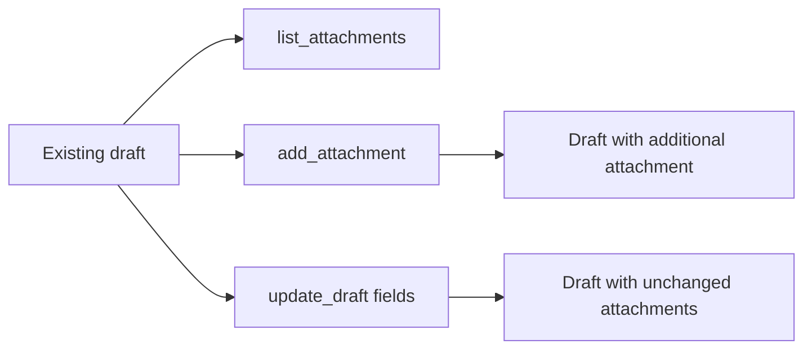
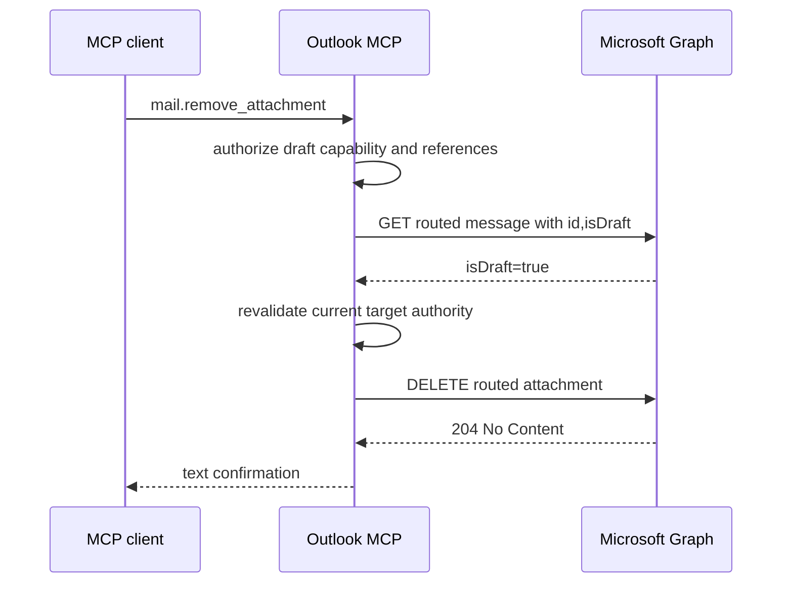

# Remove attachments from existing drafts

## Change Summary

The mail domain can add an attachment to an existing draft but cannot remove
an attachment that is already present. The server will add a single
`remove_attachment` operation that permanently removes one attachment from a
verified own-mail or shared-mail draft.

Microsoft Graph does not expose an atomic attachment replacement operation.
This change therefore does not add `replace_attachment`; callers can explicitly
remove an old attachment and then invoke the existing `add_attachment` operation.

## Motivation and Background

Draft editing is incomplete when attachments can only be appended. A user who
selects the wrong file, attaches an outdated version, or changes the purpose of
a draft currently has to leave the MCP workflow and edit the draft in Outlook.

Microsoft Graph supports deleting one message attachment through the message's
attachment collection. The existing delegated `Mail.ReadWrite` permission used
for draft management is sufficient, so this change does not broaden OAuth scope.

The operation is destructive because attachment content is permanently removed
from the draft. It is idempotent at the resource-state level because repeating
the request cannot remove a second attachment with a different identifier.

## Change Drivers

* Complete the attachment portion of the draft lifecycle.
* Keep draft mutations available through the existing exact `draft` capability.
* Preserve target-bound shared-mail routing and reference validation.
* Avoid inventing an atomic replacement guarantee that Graph does not provide.

## Current State

The `mail` aggregate tool supports these attachment operations:

* `list_attachments` reads attachment metadata.
* `get_attachment` reads attachment content within configured size limits.
* `add_attachment` adds one allowlisted local file to an existing draft.

There is no operation that removes an attachment. Updating draft recipients,
subject, body, content type, or importance does not modify the attachment
collection.



## Proposed Change

Add `mail.remove_attachment` to the mail verb registry. The operation will
accept an existing draft and one attachment identity, verify that the message
is still a draft, revalidate current authority immediately before mutation,
and call the exact routed Microsoft Graph attachment DELETE endpoint once.

Own-mail requests will use `message_id` and `attachment_id`. Shared-mail
requests will use `shared_resource`, `draft_ref`, and `attachment_ref`. Shared
raw identifiers will remain rejected.



## Requirements

### Functional Requirements

1. The mail aggregate tool **MUST** register `remove_attachment` as a verb.
2. The operation **MUST** require the selected target's exact `draft` capability.
3. The operation **MUST** reject any message not confirmed as `isDraft=true`.
4. Own-mail requests **MUST** require `message_id` and `attachment_id`.
5. Shared-mail requests **MUST** require `shared_resource`, `draft_ref`, and `attachment_ref`.
6. Shared-mail requests **MUST** reject raw message and attachment identifiers.
7. The attachment reference **MUST** bind the same account, resource, mailbox view, and parent draft as the routed draft reference.
8. The operation **MUST** revalidate current target authority after draft preflight and immediately before deletion.
9. The operation **MUST** call only the exact routed attachment endpoint selected by middleware.
10. A successful deletion **MUST** return a plain-text confirmation containing the draft ID and attachment ID.
11. A successful shared deletion **MUST** identify the configured shared target without exposing mailbox credentials or tokens.
12. The operation **MUST NOT** expose a `replace_attachment` verb.
13. The existing `add_attachment` behavior **MUST** remain unchanged.

### Non-Functional Requirements

1. The operation **MUST** declare read-only false, destructive true, idempotent true, and open-world true annotations.
2. The aggregate mail annotations **MUST** remain conservative across all registered mail verbs.
3. The mutation **MUST NOT** fall back from a shared owner route to `/me`.
4. The mutation **MUST NOT** use automatic SDK retries that could obscure the outcome of a destructive request.
5. Errors **MUST** use the existing Graph redaction behavior.
6. The handler and all new helper functions **MUST** have Go documentation comments.
7. The CRUD prompt **MUST** exercise successful removal and non-draft rejection.

## Affected Components

* `internal/tools` for the new handler and attachment-reference validation.
* `internal/server` for verb registration, schema, routing, and capability mapping.
* `internal/audit` for capability classification.
* `internal/tools/tool_annotations_test.go` for help annotation coverage.
* `internal/server/mail_profiles_test.go` for static capability coverage.
* `docs/prompts/mcp-tool-crud-test.md` for lifecycle coverage.
* `docs/concepts.md` for the cross-verb local draft attachment concept.

## Scope Boundaries

### In Scope

* Removing one attachment from an existing own-mail draft.
* Removing one attachment from an existing organizational shared-mail draft.
* Exact parent-draft binding for shared attachment references.
* Draft-state preflight before the destructive call.
* Capability, read-only, audit, and observability middleware integration.
* Text confirmation and redacted error handling.

### Out of Scope ("Here, But Not Further")

* A `replace_attachment` operation.
* Atomic remove-and-upload behavior.
* Rollback or restoration of removed attachment bytes.
* Removing attachments from sent or received messages.
* Removing calendar-event attachments.
* Bulk attachment removal.
* Removal by attachment name or ordinal position.
* Changing local attachment allowlist or upload size limits.
* Adding OAuth permissions.

## Alternative Approaches Considered

### Add a synthetic replace operation

Rejected. Graph exposes separate DELETE and POST operations, so a replacement
would have a visible intermediate state and could fail after deletion. Naming
that workflow `replace_attachment` would imply an atomic guarantee the server
cannot provide.

### Extend update_draft with attachment arrays

Rejected. Graph message PATCH does not provide the desired attachment mutation
contract, and combining scalar draft updates with independent attachment
collection mutations would weaken failure reporting.

### Require callers to use Outlook for removal

Rejected. This preserves an avoidable lifecycle gap even though Graph provides
the required operation under the server's existing permission model.

## Impact Assessment

### User Impact

Users can correct draft attachments without leaving the MCP workflow. Because
removal is permanent, help output and tool annotations will clearly identify
the operation as destructive.

### Technical Impact

The change adds one registry verb and one small handler. It does not introduce
a new top-level MCP tool, configuration value, dependency, OAuth scope, output
tier, or persistence format.

### Business Impact

The capability improves draft-management completeness with low implementation
and maintenance cost. No migration or deployment coordination is required.

## Implementation Approach

1. Add a draft-attachment identity resolver for own and shared routes.
2. Add a handler that performs target resolution, ID validation, draft
   preflight, authority revalidation, and one attachment DELETE.
3. Register the handler in the mail verb registry with explicit annotations.
4. Map the verb to the exact draft capability in server and audit policy.
5. Add route, safety, capability, annotation, and documentation tests.
6. Update the CRUD lifecycle prompt and the attachment concept.

## Test Strategy

### Tests to Add

| Test File | Test Name | Description | Inputs | Expected Output |
|-----------|-----------|-------------|--------|-----------------|
| `internal/tools/remove_attachment_test.go` | `TestRemoveAttachmentUsesExactOwnRoute` | Own draft preflight and deletion | own IDs | GET then exact DELETE and confirmation |
| `internal/tools/remove_attachment_test.go` | `TestRemoveAttachmentRejectsNonDraft` | Non-draft safety gate | `isDraft=false` | error and no DELETE |
| `internal/tools/remove_attachment_test.go` | `TestRemoveSharedAttachmentUsesBoundReferences` | Shared parent binding and route | routed draft plus attachment ref | owner-route GET and DELETE |
| `internal/tools/remove_attachment_test.go` | `TestRemoveSharedAttachmentRejectsCrossParentReference` | Local reference rejection | mismatched parent chain | error and no Graph traffic |
| `internal/tools/remove_attachment_test.go` | `TestRemoveSharedAttachmentRevalidatesBeforeDelete` | Revoked policy safety | reauthorization error | preflight GET only |
| `internal/server/mail_profiles_test.go` | `TestCR0070RemoveAttachmentAnnotations` | Per-verb annotations | registered verb | destructive and idempotent |

### Tests to Modify

| Test File | Test Name | Current Behavior | New Behavior | Reason for Change |
|-----------|-----------|------------------|--------------|-------------------|
| `internal/server/mail_profiles_test.go` | `TestBuildMailVerbsIsStaticAndDeclaresCapabilities` | add attachment only | add and remove require draft | capability completeness |
| `internal/tools/tool_annotations_test.go` | `TestCR0066PerVerbAnnotations_DocumentedInHelp` | existing mutation names | includes remove attachment | help discoverability |

### Tests to Remove

Not applicable. No existing behavior or coverage becomes obsolete.

## Acceptance Criteria

### AC-1: Remove an own-mail draft attachment

```gherkin
Given an own-mail message is confirmed as a draft
  And the requested attachment exists on that draft
When mail.remove_attachment is called with its message and attachment IDs
Then the server deletes that exact attachment once
  And returns a plain-text confirmation
```

### AC-2: Protect non-draft messages

```gherkin
Given a sent or received message has an attachment
When mail.remove_attachment is called for that message
Then the server rejects the request after the draft preflight
  And sends no attachment DELETE request
```

### AC-3: Preserve shared-mail route integrity

```gherkin
Given a shared-mail alias has the exact draft capability
  And the draft and attachment references bind the same owner-view route
When mail.remove_attachment is called
Then the server deletes through /users/{owner}/messages/{draft}/attachments/{attachment}
  And never falls back to /me
```

### AC-4: Reject mismatched attachment provenance

```gherkin
Given an attachment reference belongs to another draft or mailbox
When mail.remove_attachment is called with that reference
Then the server rejects it locally
  And sends no Graph request
```

### AC-5: Recheck current authority

```gherkin
Given a shared draft passes the isDraft preflight
  And its draft policy is revoked before mutation
When mail.remove_attachment reaches the commit boundary
Then the server rejects the request
  And sends no DELETE request
```

### AC-6: Do not advertise replacement

```gherkin
Given a client inspects mail help and the aggregate schema
When the registered operation names are returned
Then remove_attachment is present
  And replace_attachment is absent
```

## Quality Standards Compliance

### Build and Compilation

- [ ] `make build` passes.
- [ ] No compiler warnings are introduced.

### Linting and Code Style

- [ ] `make fmt-check` passes.
- [ ] `make vet` passes.
- [ ] `make lint` passes.
- [ ] New exported symbols and functions have intent-focused documentation.

### Test Execution

- [ ] `make test` passes.
- [ ] New route and safety tests pass.
- [ ] Existing draft and attachment tests remain unchanged and pass.

### Documentation

- [ ] Registry help describes parameters and safety semantics.
- [ ] The attachment concept describes permanent removal.
- [ ] The CRUD prompt removes an attachment and confirms absence.

### Verification Commands

```bash
make fmt
make ci
```

## Risks and Mitigation

### Risk 1: Removing an attachment from the wrong message

**Likelihood:** low

**Impact:** high

**Mitigation:** Bind shared attachment references to their exact parent draft,
validate own IDs, and preflight the routed message as a draft.

### Risk 2: Policy changes between preflight and mutation

**Likelihood:** low

**Impact:** high

**Mitigation:** Revalidate the immutable target immediately before DELETE.

### Risk 3: Ambiguous transport failure

**Likelihood:** low

**Impact:** medium

**Mitigation:** Disable SDK retries and return a message directing the caller
to inspect the draft before attempting any subsequent mutation.

## Dependencies

* Existing mail target routing and reference codec from CR-0067.
* Existing exact draft action policy from CR-0068.
* Microsoft Graph message attachment DELETE endpoint.
* Existing `Mail.ReadWrite` delegated permission.

## Estimated Effort

Approximately one development day including implementation, tests,
documentation, and quality checks.

## Decision Outcome

Chosen approach: add only `mail.remove_attachment`, because it maps directly to
the native Graph operation and does not imply unsupported replacement atomicity.

## Implementation Status

* **Started:** 2026-07-22
* **Completed:** pending
* **Deployed to Production:** pending
* **Notes:** Implementation is being developed on the source branch without modifying unrelated worktree changes.

## Related Items

* CR-0066 per-account mail profiles, attachments, and send.
* CR-0067 per-account shared Outlook resources.
* CR-0068 granular mail action policies.
* [Microsoft Graph delete attachment](https://learn.microsoft.com/en-us/graph/api/attachment-delete?view=graph-rest-1.0)
