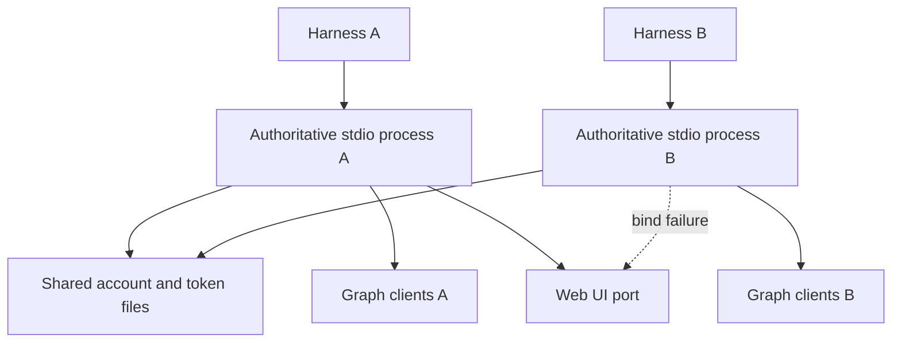
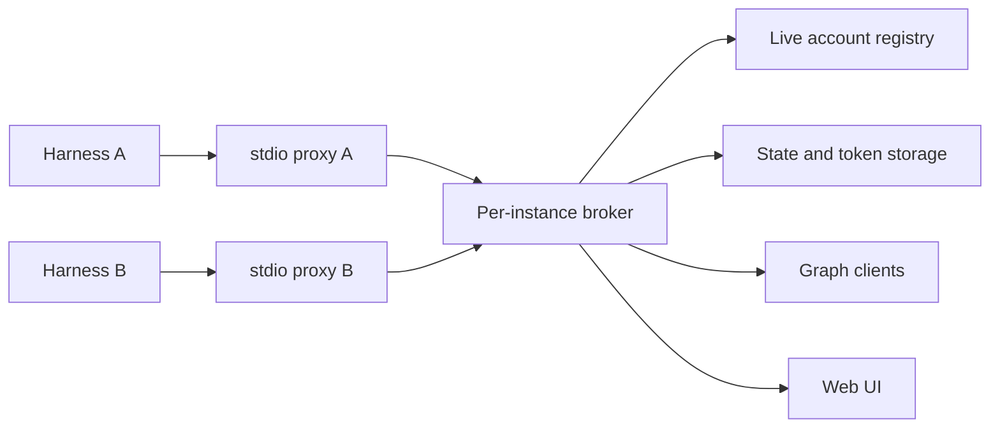
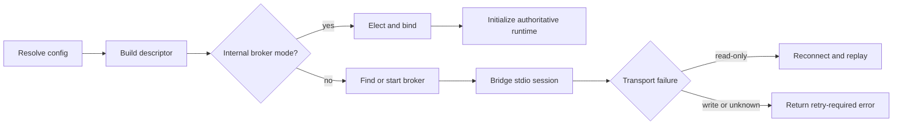

# Per-Instance MCP Broker and Live Multi-Harness State

## Change Summary

Replace independent authoritative stdio runtimes with lightweight stdio proxies
connected to one dedicated broker for each compatible application instance. The
broker owns account state, Graph clients, authentication, persistence, startup
validation, telemetry, and the local web UI.

Equivalent harness launches must share live state without requiring Codex or MCP
restarts. Launches from different executable locations, persistence realms, or
incompatible configurations must remain isolated. Broker recovery may replay
interrupted read-only verbs, but interrupted writes must return an explicit
retry-required error and must never be replayed automatically.

## Motivation and Background

Codex and other agent harnesses may launch one stdio MCP process per task,
workspace, or connection. Four visible processes can therefore represent four
valid client sessions rather than an accidental application loop.

The current executable treats every launch as authoritative. Each process loads
`accounts.json`, creates an in-memory registry, restores credentials, creates
Graph clients, starts validation, opens audit and log files, and tries to bind
the same web UI port. Process-local locks prevent races inside one process but
cannot serialize mutations across processes.

CR-0069 intentionally made authentication sessions process-bound and introduced
one transport-neutral account-administration module. That module provides the
right internal seam for a broker: MCP and web adapters can share one module, but
the module must now live in one authoritative process rather than every stdio
process.

Restarting Codex after every account or permission change is not acceptable.
Many independent workflows may be running, and restarting the host disrupts
unrelated work. Changes made through the UI or any MCP client must therefore be
visible to all other compatible clients immediately.

## Change Drivers

* Multiple harness sessions must not create multiple state owners.
* Account changes must propagate without process or host restarts.
* Different installations must not connect merely because a port is occupied.
* Different databases or file stores must always remain isolated.
* Authentication and token caches must have one runtime owner.
* MCP client capabilities and elicitation must remain session-specific.
* Recovery must not duplicate sends, creates, updates, or deletes.
* Existing stdio harness configuration must continue to work transparently.

## Current State

Every executable launch performs the complete application startup lifecycle.
The process then calls the single-session `mcp-go` stdio adapter with its own
registry and Graph clients.

The account file uses atomic replacement, but a read-modify-write sequence is
not protected by an operating-system lock shared between processes. The new
account-administration mutex is likewise process-local.

The local web UI binds `127.0.0.1:8155`. One process succeeds and other processes
continue with the UI disabled. The successful UI changes only its process's
registry. Other runtimes retain stale state until restarted and can later write
older snapshots back to persistence.

### Current State Diagram



## Proposed Change

Every ordinary executable launch becomes a stdio proxy. It calculates a
versioned instance descriptor, locates a compatible broker, and starts a broker
child when none exists. The broker child is not owned by the first harness's
stdin lifecycle.

The broker hosts a stateful multi-session MCP transport on an authenticated
loopback endpoint selected through deterministic election. Each proxy maps one
harness stdio stream to one broker MCP session.

The broker is the only process permitted to initialize mutable application
subsystems. Proxies do not open account files, token caches, Graph clients,
audit files, or the web UI.

### Proposed State Diagram



## Requirements

### Functional Requirements

1. Every normal launch **MUST** expose the existing MCP stdio interface.
2. The first compatible launch **MUST** start a dedicated broker when none exists.
3. Every compatible launch **MUST** create an independent broker MCP session.
4. The broker **MUST** outlive the stdin lifecycle of the launch that created it while other clients remain connected.
5. The broker **MUST** stop after the configured grace period when no clients remain.
6. The broker **MUST** exclusively own the account registry.
7. The broker **MUST** exclusively own account and authentication persistence for its state realm.
8. The broker **MUST** exclusively own Graph clients and startup validation.
9. The broker **MUST** exclusively own the optional web UI listener.
10. Account changes **MUST** be visible to every connected compatible client on its next operation.
11. Account changes **MUST NOT** require restarting Codex or reconnecting MCP clients.
12. Authentication completion **MUST** make the new grant visible to every connected compatible client immediately.
13. The instance identity **MUST** include a canonical executable identity.
14. The instance identity **MUST** include a canonical state-realm identity.
15. The instance identity **MUST** include the authentication cache namespace.
16. The instance identity **MUST** include a versioned behavior-configuration fingerprint.
17. Executables at different canonical paths **MUST NOT** share a broker by default.
18. Different state-realm identities **MUST NOT** share a broker.
19. A compatibility handshake **MUST** reject mismatched protocol versions.
20. A compatibility handshake **MUST** reject mismatched state realms.
21. An explicit instance override **MUST NOT** override a state-realm mismatch.
22. A broker endpoint occupied by an unrelated process **MUST NOT** be treated as a compatible broker.
23. Every proxy **MUST** preserve its harness's MCP initialization and capabilities.
24. Every proxy **MUST** preserve server notifications and client responses.
25. Every proxy **MUST** preserve elicitation, sampling, roots, and cancellation traffic.
26. The broker **MUST** publish an authoritative read-only replay catalog derived from per-verb metadata.
27. A proxy **MUST** cache the replay catalog for recovery classification.
28. A proxy **MUST** automatically reconnect after broker loss when possible.
29. A proxy **MUST** replay MCP initialization into a replacement broker session.
30. A proxy **MUST** automatically replay an interrupted tool call only when the catalog marks the exact domain verb read-only.
31. A proxy **MUST NOT** automatically replay an interrupted write or destructive verb.
32. An interrupted write **MUST** return a structured retry-required error to the harness.
33. The retry-required error **MUST** explain that execution outcome may be unknown.
34. The retry-required error **MUST** ask the agent to inspect state before retrying when the operation is not naturally idempotent.
35. A request without an exact replay classification **MUST** be treated as non-replayable.
36. Broker status **MUST** expose role, instance fingerprint, state fingerprint, broker PID, client count, and UI ownership.
37. Logs and audit records **MUST** include a broker client/session identifier.
38. Separate brokers **MUST** retain independent web UI bind outcomes.
39. UI port occupation **MUST NOT** influence broker identity or broker selection.
40. Existing account and permission behavior from CR-0069 **MUST** remain authoritative.

### Non-Functional Requirements

1. Broker coordination **MUST** be confined to the local machine.
2. Internal loopback transport **MUST** require a per-broker cryptographic capability token.
3. Capability tokens **MUST NOT** appear in logs, status responses, process arguments, or URLs.
4. Broker descriptor files **MUST** be readable only by the current user where the platform supports permissions.
5. Instance fingerprints **MUST** exclude database passwords, access tokens, and other secrets.
6. Canonical path comparison on Windows **MUST** be case-insensitive.
7. Broker election **MUST** permit exactly one winner for one instance identity.
8. Losing broker candidates **MUST** exit before initializing mutable state.
9. A stale descriptor **MUST** be recoverable without manual deletion.
10. Proxy forwarding **MUST** preserve JSON-RPC request identifiers exactly.
11. Concurrent proxy responses **MUST** serialize writes to harness stdout.
12. Broker failure **MUST NOT** cause automatic replay of an unclassified request.
13. The implementation **MUST** remain one distributable executable.
14. The implementation **MUST** keep broker and proxy logic in small single-purpose files.
15. The implementation **MUST** use a deep coordination module with one external interface.
16. Ordinary MCP calls **MUST NOT** require filesystem polling.
17. The broker **MUST** bound client leases and idle shutdown timers.
18. Existing loopback web security controls **MUST** remain active.

## Affected Components

* `cmd/outlook-local-mcp` startup and internal broker mode.
* New `internal/instancebroker` coordination module.
* MCP construction and tool registration.
* Per-verb annotations and replay classification.
* Account administration and authentication lifecycle ownership.
* Web UI lifecycle and status diagnostics.
* Audit and observability client attribution.
* Configuration, manifest, concepts, quickstart, troubleshooting, and architecture docs.

## Scope Boundaries

### In Scope

* Transparent stdio proxying.
* Dedicated broker creation and discovery.
* Current-user local authentication token for the broker transport.
* File-backed state-realm identity used by the current implementation.
* Extensible realm descriptors for future SQLite or server SQL adapters.
* Live account state across connected harnesses.
* Broker crash recovery.
* Read-only request replay.
* Write retry-required errors.
* Broker-owned web UI.

### Out of Scope ("Here, But Not Further")

* Remote-network MCP hosting.
* Sharing one broker across different machines or OS users.
* Distributed database leader election.
* Automatic replay of write operations.
* Exactly-once Graph write semantics.
* Migrating the current account store to SQL.
* Changing Graph tool behavior unrelated to process coordination.
* Automatically selecting a replacement web UI port for separate instances.

## Alternative Approaches Considered

* Filesystem watching with independent processes was rejected because it leaves multiple token-cache and registry owners.
* A first-harness primary was rejected because harness shutdown would disrupt unrelated sessions.
* Fixed-port discovery was rejected because port ownership does not prove compatible state identity.
* Manual Streamable HTTP configuration was rejected because transparent stdio compatibility is required.
* Automatic write replay was rejected because transport loss cannot prove whether Graph committed the operation.

## Impact Assessment

### User Impact

Users retain the same executable command and stdio harness configuration. Multiple
tasks share account and authentication changes immediately. Broker failure may
surface a retry-required error for an interrupted write, which is safer than a
silent duplicate.

### Technical Impact

Startup splits into proxy and broker modes. MCP construction must become reusable,
and a stateful multi-session transport becomes the authoritative adapter. The
existing account administration module remains the state seam inside the broker.

### Business Impact

The change improves reliability for multi-agent workflows and avoids disruptive
Codex restarts. It adds implementation and testing complexity but no separate
installation artifact or hosted infrastructure.

## Implementation Approach

Create an `instancebroker` module whose interface accepts a resolved descriptor
and either serves the current stdio stream through a compatible broker or runs
the internal broker lifecycle. Keep endpoint discovery, election, authentication,
leases, reconnection, and replay decisions behind this interface.

The production adapter uses authenticated IPv4 loopback HTTP with a stateful MCP
handler. An in-memory adapter drives deterministic tests at the same seam.

### Implementation Flow



## Test Strategy

### Tests to Add

| Test File | Test Name | Description | Inputs | Expected Output |
|-----------|-----------|-------------|--------|-----------------|
| `internal/instancebroker/identity_test.go` | `TestDescriptorSeparatesExecutablePaths` | C and D installations isolate | canonical paths | different instance IDs |
| `internal/instancebroker/identity_test.go` | `TestDescriptorSeparatesStateRealms` | databases isolate | different realm IDs | different instance IDs |
| `internal/instancebroker/election_test.go` | `TestConcurrentElectionHasOneWinner` | launch race | many candidates | one broker |
| `internal/instancebroker/handshake_test.go` | `TestHandshakeRejectsRealmMismatch` | explicit ID collision | different realm | rejection |
| `internal/instancebroker/proxy_test.go` | `TestIndependentClientSessions` | two harnesses | capabilities | isolated sessions |
| `internal/instancebroker/proxy_test.go` | `TestLiveAccountStateNeedsNoRestart` | UI mutation then MCP read | connected clients | immediate new state |
| `internal/instancebroker/recovery_test.go` | `TestReadOnlyCallReplayedAfterFailure` | interrupted read | broker loss | one successful replay |
| `internal/instancebroker/recovery_test.go` | `TestWriteCallReturnsRetryRequired` | interrupted write | broker loss | no replay and error |
| `internal/instancebroker/recovery_test.go` | `TestUnknownCallIsNotReplayed` | unclassified call | broker loss | no replay |
| `internal/instancebroker/lifecycle_test.go` | `TestBrokerOutlivesFirstProxy` | first disconnects | second remains | broker alive |
| `internal/instancebroker/lifecycle_test.go` | `TestIdleBrokerStopsAfterGrace` | no leases | elapsed grace | broker exits |
| `internal/instancebroker/security_test.go` | `TestCapabilityTokenRequired` | absent token | local request | unauthorized |
| `internal/instancebroker/webui_test.go` | `TestOnlyBrokerStartsWebUI` | many proxies | UI enabled | one listener |

### Tests to Modify

| Test File | Test Name | Current Behavior | New Behavior | Reason for Change |
|-----------|-----------|------------------|--------------|-------------------|
| `cmd/outlook-local-mcp/main_test.go` | startup lifecycle tests | direct stdio runtime | proxy or internal broker | lifecycle split |
| `internal/server/server_test.go` | registration fixtures | no replay catalog | catalog derived from annotations | recovery policy |
| `internal/tools/status_test.go` | status features | process-local UI | broker diagnostics | observability |
| `internal/webui/server_test.go` | account changes | one process only | broker-owned live state | multi-client behavior |

### Tests to Remove

No behavior test is removed solely to reduce coverage. Tests that directly assert
the old single authoritative stdio lifecycle must be replaced by broker-interface
tests once equivalent behavior is covered through the new seam.

## Acceptance Criteria

### AC-1: Equivalent launches share one broker

```gherkin
Given two harnesses launch the same canonical executable with the same resolved state realm and configuration
When both initialize MCP concurrently
Then exactly one broker owns mutable state
  And both harnesses receive independent initialized sessions
```

### AC-2: Different installations remain isolated

```gherkin
Given one launch resolves to C:\outlook_mcp.exe and another resolves to D:\outlook_mcp.exe
When both initialize with otherwise equal configuration
Then they use different instance fingerprints
  And neither forwards requests to the other broker
```

### AC-3: Different databases remain isolated

```gherkin
Given two launches resolve different state-realm identities
When both brokers are running
Then each broker accesses only its own state realm
  And an explicit instance-ID collision is rejected
```

### AC-4: Account changes propagate live

```gherkin
Given two connected MCP clients share one broker
When the web UI changes an account permission
Then both clients observe the new permission on their next operation
  And neither Codex nor either MCP connection is restarted
```

### AC-5: Authentication propagates live

```gherkin
Given an account requires re-authentication and several clients share one broker
When authentication completes through the web UI
Then every client can use the current grant immediately
  And no proxy reloads persistence independently
```

### AC-6: Read-only failure is replayed

```gherkin
Given an exact domain verb is marked read-only in authoritative per-verb metadata
When its broker transport fails before a response is received
Then the proxy reconnects and replays initialization
  And the proxy automatically submits the read operation once to the replacement broker
```

### AC-7: Write failure requires agent retry

```gherkin
Given a write or destructive verb is in flight
When the broker connection fails before a response is received
Then the proxy does not submit the operation to the replacement broker
  And the harness receives a retry-required error stating that the outcome may be unknown
```

### AC-8: Unknown operations fail safe

```gherkin
Given an operation has no exact replay classification
When its transport is interrupted
Then the proxy treats it as non-replayable
  And it does not automatically submit the operation again
```

### AC-9: First proxy may exit

```gherkin
Given two proxies are connected and the first launch created the broker
When the first proxy exits
Then the second proxy continues using the broker
  And active MCP work is not interrupted
```

### AC-10: UI has one owner

```gherkin
Given several compatible proxies request the web UI
When their shared broker starts
Then only the broker binds the configured UI port
  And every proxy reports the same UI URL
```

## Quality Standards Compliance

### Build and Compilation

- [ ] `make build` passes.
- [ ] `make vet` passes.
- [ ] No new compiler warnings are introduced.

### Linting and Code Style

- [ ] `make fmt-check` passes.
- [ ] `make lint` passes.
- [ ] Every package, type, field, function, and method has required Go documentation.

### Test Execution

- [ ] New broker module tests pass.
- [ ] Multi-process integration tests pass.
- [ ] Existing retained tests pass.
- [ ] Race-enabled tests pass.

### Documentation

- [ ] Concepts explain instance and state-realm identity.
- [ ] Quickstart documents transparent broker behavior.
- [ ] Troubleshooting documents broker mismatch and write retry errors.
- [ ] Architecture documents proxy, broker, account administration, and storage seams.
- [ ] The CRUD prompt exercises broker status and live state.

### Code Review

- [ ] Changes are submitted through a pull request.
- [ ] PR title follows Conventional Commits.
- [ ] Changes are squash-merged.

### Verification Commands

```bash
make build
make vet
make fmt-check
make tidy
make lint
make test
make sbom
make vuln-scan
make license-check
make ci
```

## Risks and Mitigation

### Risk 1: A write commits before transport loss

**Likelihood:** medium

**Impact:** high

**Mitigation:** Never replay writes automatically. Return an unknown-outcome,
retry-required error and instruct the agent to inspect current state first.

### Risk 2: Broker identity joins the wrong store

**Likelihood:** low

**Impact:** critical

**Mitigation:** Versioned descriptor, canonical executable and realm identities,
authenticated handshake, and mandatory full compatibility comparison.

### Risk 3: Broker child becomes orphaned

**Likelihood:** medium

**Impact:** medium

**Mitigation:** Client leases, bounded expiry, idle shutdown, and no persistent
daemon registration.

### Risk 4: Multi-session transport changes elicitation behavior

**Likelihood:** medium

**Impact:** high

**Mitigation:** Preserve one stateful MCP session per proxy and add two-client
elicitation and capability-isolation integration tests.

### Risk 5: Replay catalog drifts from tool behavior

**Likelihood:** low

**Impact:** high

**Mitigation:** Derive the catalog from the same per-verb annotations used by
help and tests. Unknown identities always fail closed.

### Risk 6: Internal endpoint is accessed by another local process

**Likelihood:** low

**Impact:** high

**Mitigation:** Bind IPv4 loopback, require an unguessable token, restrict the
descriptor file, and redact all endpoint credentials.

## Dependencies

* CR-0069 transport-neutral administration and web UI.
* ADR-0001 per-instance broker decision.
* `mark3labs/mcp-go` v0.45.0 stateful Streamable HTTP implementation.
* Go standard-library HTTP, process, hashing, and filesystem primitives.

DeepWiki validation was unavailable during implementation. Package behavior was
validated against the locally downloaded `mark3labs/mcp-go` v0.45.0 source,
which is already listed in `.deepwiki`.

## Estimated Effort

* Governance and reusable server construction: 1-2 days.
* Identity, election, endpoint security, and lifecycle: 3-5 days.
* Stateful stdio proxy and recovery: 4-6 days.
* Ownership migration, UI, status, and audit integration: 2-4 days.
* Multi-process and failure testing: 3-5 days.

## Decision Outcome

Chosen approach: a dedicated per-instance broker with transparent stdio proxies,
because it provides one live state owner, preserves harness compatibility, and
isolates deployments and state stores. Read-only operations may recover
automatically; writes remain explicitly agent-retried after uncertain failures.

## Implementation Status

* **Started:** 2026-07-22
* **Completed:** 2026-07-22
* **Deployed to Production:** not deployed
* **Notes:** Implemented with authenticated loopback Streamable HTTP, deterministic
  instance and state-realm election, live proxy leases, annotation-derived read
  replay, explicit write retry errors, broker status diagnostics, and an updated
  Windows executable. Focused unit, two-client, failover, and UI-enabled smoke
  checks passed. The full repository test suite and `go vet ./...` also pass on
  Windows after closing reconfigured audit handles and making path, home-directory,
  permission-mode, JSON-path, and atomic-failure tests platform-aware.

## Related Items

* [ADR-0001 per-instance MCP broker](../adr/ADR-0001-per-instance-mcp-broker.md)
* [CR-0069 local web account administration](CR-0069-local-web-account-administration.md)
* [CR-0068 granular mail action policies](CR-0068-granular-mail-action-policies.md)
